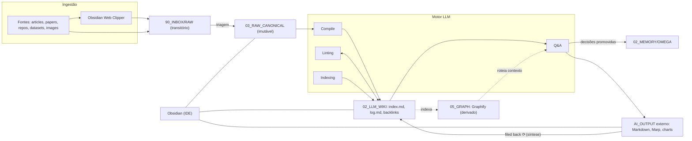
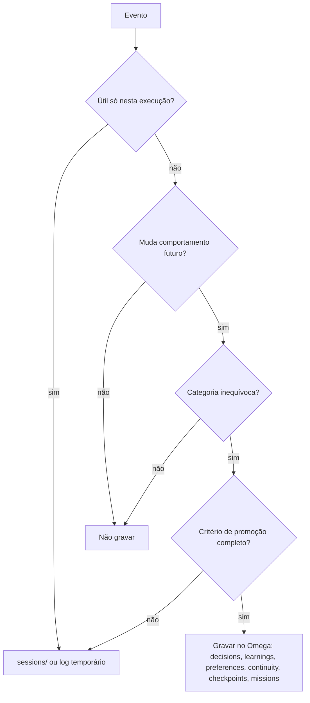

# AI_CORE × LLM Wiki — Documento Mestre

> [!abstract] TL;DR
> As fontes brutas entram por **uma única porta** (`90_INBOX/RAW`) e ficam preservadas, imutáveis, em `03_RAW_CANONICAL`. O LLM **compila** essas fontes em uma wiki Markdown (`02_LLM_WIKI`) com `index.md`, `log.md`, frontmatter e backlinks. Consultas (Q&A) e auditorias (lint) enriquecem a wiki continuamente. Os artefatos pesados saem do núcleo para `AI_OUTPUT/`, mas o **conhecimento** que geram volta para a wiki (*filed back ⟳*). Tudo é navegado no Obsidian.
>
> **Obsidian é a IDE. O LLM é o engenheiro. A wiki é a base de código.**
> Graphify localiza. Omega lembra. Os domínios guardam estado. Os agentes executam dentro de escopos. Os outputs saem do núcleo.

---

## 0. Como ler esta nota

Esta é a **página de visão geral canônica** do ecossistema AI_CORE. Ela junta seis fontes (ver [[#Apêndice B — Proveniência das fontes|Apêndice B]]) em um único estado de verdade, organizado em três planos:

1. **O padrão**: a filosofia LLM Wiki de Karpathy.
2. **O estado atual**: a topologia do AI_CORE representada nos diagramas.
3. **O estado-alvo**: a arquitetura proposta pela auditoria de 2026-09-28.

### 0.1 Marcadores de status

| Marcador | Significado |
|---|---|
| `CANÔNICO` | Vale agora. É um princípio do padrão Karpathy ou um fato consistente em todas as fontes. |
| `AS-IS` | Estado atual representado nos diagramas de 2026-09-28. **Não foi verificado fisicamente no disco.** |
| `TARGET` | Arquitetura-alvo da auditoria, com status `proposed`. **Não aplicar sem inventário e plano de migração.** |
| `SÍNTESE` | Conciliação feita nesta compilação onde as fontes divergiam ou não diziam nada. Também tem status `proposed`. |

### 0.2 Convenção de links desta nota

- Os wikilinks usam **caminho-sufixo** a partir da pasta de 2º nível, por exemplo `[[02_LLM_WIKI/index|index.md]]`, e não o caminho completo `01_KNOWLEDGE/OBSIDIAN_VAULT/02_LLM_WIKI/index`. O Obsidian resolve o link pelo final do caminho, então ele continua funcionando depois da migração AS-IS → TARGET.
- Pastas aparecem como `código`, sem wikilink, porque o Obsidian liga notas e não diretórios.
- `.agents/` e `.obsidian/` ficam ocultos para o Obsidian e por isso só aparecem como código.
- **Links não resolvidos são intencionais.** Cada um aponta para uma página que ainda não existe. Isso funciona como backlog que o lint (§5) detecta como "conceito mencionado sem página própria".

---

## 1. Visão Geral e Tese Central

### 1.1 O problema: conhecimento efêmero (RAG)

A maioria das pessoas usa LLMs com documentos no modelo **RAG**. Você envia os arquivos, o LLM recupera trechos na hora da pergunta e gera uma resposta. Funciona, mas **nada se acumula**. Uma pergunta sutil que exige sintetizar cinco documentos obriga o modelo a reencontrar e recombinar os mesmos fragmentos toda vez. NotebookLM, uploads no ChatGPT e a maioria dos sistemas RAG funcionam assim.

### 1.2 A tese: memória cumulativa compilada `CANÔNICO`

O LLM **constrói e mantém incrementalmente uma wiki persistente**: uma coleção interligada de arquivos Markdown que fica entre o humano e as fontes brutas. Quando uma fonte nova chega, o LLM:

- lê a fonte e extrai o que importa;
- atualiza as páginas de entidades e conceitos;
- revisa os resumos de tópicos;
- sinaliza onde os dados novos **contradizem** afirmações antigas;
- fortalece ou questiona a síntese em evolução.

O conhecimento é **compilado uma vez e mantido atualizado**, em vez de ser derivado de novo a cada consulta. As referências cruzadas já existem, as contradições já foram marcadas e a síntese já reflete tudo o que foi lido. **A wiki é um artefato cumulativo**: fica mais rica a cada fonte ingerida e a cada pergunta feita.

### 1.3 A tríade e o schema

| Papel | No padrão Karpathy | No AI_CORE |
|---|---|---|
| **IDE**: visualização humana | Obsidian: grafos, canvas, navegação, Marp | Cofre com raiz em `AI_CORE/` (`.obsidian/`) e entrada por [[00_HOME/Visão\|00_HOME]] |
| **Engenheiro**: lê, compila, audita, indexa | Agente LLM (Claude Code, Codex, OpenCode…) | Claude Code (extensão apontada para o **OmniRoute** em localhost) e **Antigravity IDE** (harness executor/arquiteto) |
| **Base de código**: estado único da verdade | `wiki/`, com notas `.md` atômicas e interligadas | `02_LLM_WIKI/` dentro de `01_KNOWLEDGE/` |
| **Schema**: contrato do mantenedor | `CLAUDE.md` / `AGENTS.md` | [[CLAUDE\|CLAUDE.md]], `.agents/rules`, `.agents/workflows` e, no TARGET, [[00_CONTROL/ARCHITECTURE\|00_CONTROL]] |

O schema transforma o LLM em um **mantenedor disciplinado**, e não em um chatbot genérico. Ele define estrutura, convenções e os fluxos de ingestão, consulta e manutenção, e **evolui junto com o uso**.

### 1.4 Divisão de trabalho

| Humano | LLM |
|---|---|
| Curar as fontes | Resumir |
| Direcionar a exploração | Criar referências cruzadas |
| Fazer boas perguntas | Arquivar e organizar |
| Pensar no significado | Toda a manutenção |

Na prática, o agente fica aberto de um lado e o Obsidian do outro. O LLM edita a partir da conversa e o humano acompanha em tempo real, seguindo links, olhando o Graph View e lendo as páginas atualizadas. **O humano raramente edita a wiki; ela é domínio do LLM.**

No AI_CORE essa fronteira já existe fisicamente `SÍNTESE`:

- `01_HUMAN_CORE/` (Canvas de Decisão, Diário, Estratégias, Regras de Mesa) é **domínio humano**. O LLM lê, mas só escreve quando o humano pede.
- `02_LLM_WIKI/` é **domínio do LLM**. O humano lê.

### 1.5 Por que funciona

O difícil em uma base de conhecimento não é ler nem pensar. É a **manutenção**: atualizar referências cruzadas, manter os resumos em dia, registrar contradições e manter a consistência entre dezenas de páginas. Humanos abandonam wikis porque o custo de manutenção cresce mais rápido que o valor que elas geram.

LLMs não se entediam, não esquecem uma referência cruzada e editam 15 arquivos em uma passada. **O custo de manutenção tende a zero.**

A ideia ecoa o [[02_LLM_WIKI/conceitos/Memex|Memex]] de Vannevar Bush (1945): um acervo privado, curado ativamente, em que as conexões entre documentos valem tanto quanto os próprios documentos. Bush não resolveu quem faria a manutenção. O LLM resolve.

### 1.6 Aplicações e onde o AI_CORE se encaixa

O padrão serve a qualquer acúmulo de conhecimento ao longo do tempo:

- uso **pessoal** (metas, saúde, psicologia, diário, podcasts);
- **pesquisa** (semanas ou meses de papers, com uma tese em evolução);
- **leitura de livros** (personagens, temas e tramas, como um *Tolkien Gateway* pessoal);
- **empresas e equipes** (wiki alimentada por Slack, reuniões, documentos e chamadas);
- análise competitiva, due diligence, viagens, cursos e hobbies.

O AI_CORE combina três desses usos em um só cofre `SÍNTESE`:

| Aplicação | Instância no AI_CORE |
|---|---|
| Pessoal | `01_HUMAN_CORE/` (Diário, Estratégias, Regras de Mesa) |
| Pesquisa | [[02_LLM_WIKI/Mercado Quant\|Mercado Quant]], [[02_LLM_WIKI/Agentes IA\|Agentes IA]], motor quantitativo B3 |
| Operação de negócio | [[02_LLM_WIKI/Imobiliario\|Imobiliário]]: imóveis, portais, publicação |

### 1.7 A tese aplicada: o AI_CORE é o cérebro, não a oficina inteira

**Diagnóstico (2026-09-28).** Após meses de desenvolvimento ficou claro o que funciona e o que não funciona. O AI_CORE **não está em ponto de recomeçar. Está em ponto de normalização.** Ele já tem:

- especialização por domínio;
- memória persistente;
- conhecimento canônico;
- índices e grafo;
- automação real;
- agentes especializados;
- objetos de negócio estruturados;
- preocupação com rastreabilidade.

O que falta é que essas partes operem sob **um único contrato arquitetural**.

**Causa predominante.** O problema é de **governança estrutural e de autoridade**, não de capacidade das ferramentas. Graphify, Omega, Obsidian, Claude Code, OmniRoute e Antigravity **não são a causa-raiz**. Eles amplificam a qualidade, ou a desordem, da estrutura que recebem:

> **estrutura ambígua → recuperação ambígua → contexto ambíguo → decisão ambígua → escrita sobreposta → grafo mais ruidoso → memória menos confiável**
>
> **estrutura canônica → indexação seletiva → recuperação precisa → contexto mínimo → execução delimitada → memória auditável**

**Mandato do núcleo.** O AI_CORE existe para *armazenar conhecimento canônico, memória validada, regras, índices, ferramentas e os estados necessários para que os agentes descubram e executem trabalho com o menor contexto possível*.

Não é função do núcleo:

- guardar toda exportação ou renderização;
- duplicar arquivos de origem;
- acumular sessões sem promoção;
- manter várias cópias do mesmo conhecimento;
- hospedar arquivos pesados só para que sejam encontrados.

> [!important] Princípio operacional
> Pare de pensar o AI_CORE como **um conjunto de pastas inteligentes** e passe a tratá-lo como **um sistema com camadas, autoridade, contratos de leitura/escrita e ciclo de vida da informação**, pequeno o bastante para ser compreendido, indexado e auditado.

### 1.8 Fluxo ponta a ponta



### 1.9 Correspondência Karpathy → AI_CORE

| Bloco Karpathy | `AS-IS` | `TARGET` |
|---|---|---|
| Captura (Web Clipper) | Pasta de capturas/inbox, `.user_uploaded/` | `90_INBOX/RAW/` |
| `raw/` | `01_KNOWLEDGE/OBSIDIAN_VAULT/03_RAW/` **e** `03_RAW/docs/` | `01_KNOWLEDGE/03_RAW_CANONICAL/` |
| `raw/assets/` | `03_RAW/` (assets) | `03_RAW_CANONICAL/assets/` |
| `wiki/` | `01_KNOWLEDGE/OBSIDIAN_VAULT/02_LLM_WIKI/` | `01_KNOWLEDGE/02_LLM_WIKI/` |
| Schema | `CLAUDE.md`, `.agents/rules`, `.agents/workflows` | Os mesmos, mais `00_CONTROL/` (ARCHITECTURE, ROUTING, GOVERNANCE, SCHEMAS, MIGRATIONS) |
| `index.md` / Indexing | `_INDEX.md`, `graphify-out/` na raiz | `02_LLM_WIKI/index.md` e `05_GRAPH/graphify-out/` |
| `log.md` | Não representado | `02_LLM_WIKI/log.md` |
| Extra tools / CLI | `05_SISTEMAS_E_ROTINAS/` | `04_SYSTEMS/` |
| Outputs | `05_OUTPUT/` (relatorios, apresentacoes, graficos) | `AI_OUTPUT/` fora do núcleo, com manifestos dentro |
| Filed back | Direto em `01_KNOWLEDGE/` | Síntese em `02_LLM_WIKI/analyses/` (ver §6.3) |
| Explorações futuras | `06_LAB/` (finetuning, roadmap) | `06_LAB/` só para experimentos; roadmap em `00_CONTROL/` |
| *(fora do Karpathy)* Memória operacional | `02_MEMORIA_E_GRAFOS/OMEGA/` | `02_MEMORY/OMEGA/` |
| *(fora do Karpathy)* Domínios | `03_B3_INVESTIMENTOS/`, `04_IMOBILIARIO/` | `03_DOMAINS/B3/`, `03_DOMAINS/IMOBILIARIO/` |
| *(fora do Karpathy)* Histórico | Não existe | `99_ARCHIVE/` |

---

## 2. Camada de Ingestão (`raw/`)

### 2.1 Princípio `CANÔNICO`

`raw/` é a **fonte da verdade** e o lastro de qualquer compilação. Os arquivos são **imutáveis**: o LLM lê, mas **nunca modifica, apaga ou reescreve**. Nada é "corrigido" em `raw/`. As correções acontecem na wiki, com citação da fonte.

### 2.2 Tipos de fonte e destino

| Fonte | Exemplos | Tratamento | Destino `TARGET` |
|---|---|---|---|
| **Articles** | Blogs, newsletters, ensaios técnicos, páginas web | Web Clipper → Markdown limpo, sem anúncios | `03_RAW_CANONICAL/artigos/` |
| **Papers** | PDFs do arXiv e bioRxiv, anais de congressos | Texto puro com fórmulas e citações estruturadas | `03_RAW_CANONICAL/papers/` |
| **Repos** | Repositórios Git, docs de API, arquiteturas | Leitura estrutural pela árvore de arquivos e AST | `03_RAW_CANONICAL/repos/` |
| **Datasets** | CSV, JSON, feeds (VRSync, B3, cadastros) | Análise semântica e agregações | `03_RAW_CANONICAL/datasets/` ou o objeto de domínio (§2.6) |
| **Images** | Diagramas, fotos de imóveis, plantas, screenshots | Extração de metadados por modelo multimodal (Vision) | `03_RAW_CANONICAL/assets/` ou `02_MIDIAS/` do objeto |
| **Conversas e mídia** | Chats, transcrições de vídeo, clippings | Transcrição em `.md` | `03_RAW_CANONICAL/` (hoje ficam no `03_RAW/` do vault) |

### 2.3 Porta única em dois estágios `TARGET`

**Problema atual (NC-01).** Existem duas áreas chamadas RAW, `01_KNOWLEDGE/OBSIDIAN_VAULT/03_RAW/` e `03_RAW/docs/`, e o diagrama da arquitetura cita uma terceira porta, `.user_uploaded/` (NC-09). Com isso, um agente não sabe:

- qual é a entrada oficial;
- qual é temporária;
- qual é imutável;
- qual deve ser indexada.

As consequências são duplicatas, wikilinks para cópias diferentes, nós artificiais no Graphify, resultados de busca repetidos e mais consumo de contexto.

**Contrato:** um único RAW canônico, com a entrada transitória explicitamente separada.

```text
captura (Web Clipper, upload, export de chat, .user_uploaded)
   ↓
90_INBOX/RAW/                    ← transitório · não citado pela wiki · fora do Graphify (ou em índice separado)
   ↓  triagem + Compile (§3.2) + checagem de hash contra duplicatas
01_KNOWLEDGE/03_RAW_CANONICAL/   ← imutável · indexado · citado pela wiki
```

Regras do contrato:

- **A wiki nunca cita um arquivo que está no INBOX.** A citação só existe depois da promoção para o RAW canônico.
- **Depois de promovido, o arquivo não muda.** Uma versão nova de uma fonte é um arquivo novo, e a wiki registra o `supersedes`.
- **Não podem existir duas pastas chamadas apenas `RAW` com responsabilidades parecidas.**

### 2.4 Extração de binários com rastreabilidade

O gargalo real de tokens aparece quando o Graphify ou o LLM leem Docs, XLS e PDF diretamente. Por isso, imagens e contratos passaram a ser convertidos em Markdown, o que deixa o grafo leve e rápido.

Isso é correto, **desde que o derivado não substitua silenciosamente o original como evidência** `SÍNTESE`. A conversão gera um derivado com manifesto, e o original fica no RAW canônico:

```text
arquivo_original.pdf                 ← evidência canônica (fora do Graphify)
   ↓
extracao/
   ├── arquivo_original.md           ← derivado otimizado para busca/grafo
   └── manifest.json
```

```json
{
  "source": "arquivo_original.pdf",
  "derived": "arquivo_original.md",
  "type": "extracted_text",
  "status": "derived",
  "canonical_source": "arquivo_original.pdf"
}
```

### 2.5 Imagens

- **Obsidian → Settings → Files and links → Attachment folder path:** um diretório fixo. Karpathy usa `raw/assets/`, que no TARGET é `03_RAW_CANONICAL/assets/`.
- **Obsidian → Settings → Hotkeys → "Download attachments for current file":** associe a um atalho, por exemplo `Ctrl+Shift+D`. Depois de cada captura do Web Clipper, o atalho baixa todas as imagens e elimina URLs quebradas.
- **Leitura pelo LLM:** o modelo não lê Markdown com imagens inline em uma passada só. Ele lê **primeiro o texto** e depois visualiza as imagens referenciadas separadamente para ganhar contexto.
- Imagens pesadas e binários **ficam fora do Graphify** (§5.6). O que entra no grafo é a descrição em `.md`.

> [!question] Decisão pendente (Q2)
> O cofre também tem `98_ATTACHMENTS/` para as mídias dos artigos da wiki. Um attachment path fixo em `03_RAW_CANONICAL/assets/` misturaria mídia de fonte com mídia de artigo. Opções: caminho fixo mais movimentação explícita, ou subpasta relativa à nota. Ver [[#8.4 Backlog de conhecimento|§8.4]].

### 2.6 Fontes de domínio

As fontes que pertencem a um **objeto de negócio** ficam dentro do próprio objeto e seguem a mesma regra de imutabilidade:

- **Imóvel:** `01_SOURCE/` guarda os dados originais do proprietário. Hoje isso é o `INFO.txt` na raiz da pasta do imóvel. Os dados normalizados são derivados em `03_DADOS/`.
- **B3:** `dados_mercado/` (MASTER_B3.csv, ativos_b3.csv, histórico de cotações) e `ordens_e_extratos/` (Extratos XP, Mini-índice, Performance Conta Real).

Os metadados de uma fonte **não são escritos no arquivo bruto**. Eles ficam na página-resumo da fonte na wiki (`02_LLM_WIKI/fontes/`) ou no manifesto. A exceção é o frontmatter que o Web Clipper grava no momento da captura.

---

## 3. Motor de Compilação & Motor LLM

### 3.1 As quatro operações

| Operação | Entrada | Saída | Escreve em |
|---|---|---|---|
| **Compile** (raw → wiki) | Fonte em `03_RAW_CANONICAL/` | Página de fonte e páginas de entidades e conceitos atualizadas | `02_LLM_WIKI/`, `index.md`, `log.md` |
| **Q&A** (research answers) | Pergunta | Resposta com citações em `.md`, Marp, gráfico ou canvas | `AI_OUTPUT/` e, se valer, filed back (§6.3) |
| **Linting** (health checks) | Wiki inteira ou o escopo de uma missão | Relatório de saúde, correções e sugestões | `02_LLM_WIKI/`, `log.md` (§5) |
| **Indexing** (summaries, links) | Wiki | `index.md`, MOCs, backlinks, grafo | `02_LLM_WIKI/index.md`, `05_GRAPH/` |

No AI_CORE, o **Compile** é executado por prompts de compilação e Skills do Antigravity. O **Q&A** roda em sessões interativas e subagentes. O **Linting** usa rotinas do Graphify e auditorias semânticas. O **Indexing** gera `graphify-out/` e os índices.

### 3.2 Compile: ingestão `CANÔNICO`

1. A fonte chega em `90_INBOX/RAW/` e o humano pede o processamento.
2. O LLM **lê a fonte e discute os principais aprendizados** com o humano.
3. Escreve a **página-resumo da fonte** em `02_LLM_WIKI/fontes/`.
4. Atualiza o [[02_LLM_WIKI/index|index.md]].
5. Atualiza as páginas de **entidades e conceitos** relacionadas. Uma fonte costuma tocar **de 10 a 15 páginas**.
6. Acrescenta uma entrada no [[02_LLM_WIKI/log|log.md]].
7. `SÍNTESE`: move o original para `03_RAW_CANONICAL/`, que é a promoção do §2.3.

**Modos de operação:**

- **Uma fonte por vez, com supervisão** (preferência de Karpathy): o humano lê os resumos, verifica as alterações e diz o que merece ênfase.
- **Em lote**, com menos supervisão.

O modo escolhido é **documentado no schema** para as próximas sessões.

**Tipos de página que o Compile produz:** resumo de fonte, entidade, conceito, comparação, visão geral e síntese.

**Tratamento de contradições.** Um dado novo que contradiz uma afirmação antiga **não é sobrescrito em silêncio**. O LLM:

- marca a contradição na página com uma callout `> [!warning] Contradição`, citando as duas fontes;
- atualiza o `status`/`supersedes` no frontmatter;
- registra o caso no `log.md`.

### 3.3 Q&A: consulta com descoberta barata

Fluxo Karpathy `CANÔNICO`:

1. Ler o `index.md`.
2. Abrir as páginas relevantes.
3. Sintetizar a resposta **com citações**.

Os formatos de saída são página Markdown, tabela comparativa, slides Marp, gráfico matplotlib e canvas.

Regra de ouro do AI_CORE: **descoberta barata antes de leitura cara.** O agente não precisa entrar pasta por pasta se existir um índice confiável, mas também não deve carregar todos os documentos que o índice localiza.

```text
1. interpretar a intenção
2. classificar o domínio
3. consultar index.md / Graphify
4. retornar candidatos
5. ranquear os candidatos
6. abrir só os documentos necessários (em geral 3 a 10)
7. executar
8. registrar decisão/missão se houver valor futuro
9. atualizar o índice derivado
```

Fluxo **a evitar**: tarefa → varredura ampla → injeção massiva de documentos → o LLM tenta entender arquitetura, conteúdo e decisão ao mesmo tempo.

### 3.4 Indexing

O LLM mantém resumos, índices, MOCs e backlinks. Na escala de referência de Karpathy (~100 fontes e algumas centenas de páginas), **isso substitui uma infraestrutura de embeddings**: o `index.md` resolve o roteamento.

No AI_CORE, o **Graphify** acrescenta uma camada topológica **derivada**. Ele é um roteador de contexto, não uma fonte de verdade (§7.4).

### 3.5 Pipeline de missão agêntica `TARGET`

| Etapa | O que acontece |
|---|---|
| **A. Triagem** | Transforma mensagem, artefato e objetivo no contrato abaixo |
| **B. Descoberta** | Índice e Graphify localizam candidatos sem abrir o universo inteiro |
| **C. Leitura dirigida** | O agente abre só o necessário |
| **D. Plano** | Define o que será alterado, onde, por quê e **o que não será alterado** |
| **E. Execução** | Executor trabalha dentro do `write_scope` |
| **F. Auditoria** | Checa duplicidade, arquivos inesperados, links quebrados, schemas, payloads, hashes e outputs (§5.2) |
| **G. Memória** | Só o que tem utilidade futura é promovido ao Omega (§4.9) |
| **H. Reindexação** | O Graphify atualiza o índice **depois** do estado final validado |

```yaml
# Contrato de triagem (Etapa A): toda missão declara
domain:
task_type:
source_of_truth:
read_scope:
write_scope:
expected_output:
memory_policy:
```

### 3.6 O schema como contrato executável

O schema tem de declarar:

- a estrutura do cofre;
- as convenções de página (§4.6 e §4.7);
- os workflows de ingest, query e lint;
- as permissões de escrita por camada (§4.2).

No AI_CORE, o schema está hoje em [[CLAUDE|CLAUDE.md]] (diretrizes do Claude Code) e em `.agents/rules/` e `.agents/workflows/` (diretrizes do Antigravity, incluindo `graphify.md`).

`SÍNTESE` (D010): **existe uma única fonte de regras**, que é `00_CONTROL/`:

- [[00_CONTROL/ARCHITECTURE|ARCHITECTURE]]
- [[00_CONTROL/GOVERNANCE|GOVERNANCE]]
- [[00_CONTROL/ROUTING|ROUTING]]
- `SCHEMAS/`
- `MIGRATIONS/`

`CLAUDE.md` e `.agents/rules/` passam a ser **adaptadores finos** que apontam para essa fonte. Dois agentes com dois conjuntos de regras independentes produzem a mesma deriva que dois RAWs.

### 3.7 Perfis de agente e permissões `TARGET`

O Antigravity tem um harness forte com perfil **executor e arquiteto**, mas tende a **executar cedo demais**, o que gera sobreposição e bagunça no repositório. Isso não é só um problema de modelo, é de **permissão arquitetural**. Se o mesmo agente pode interpretar, redesenhar, criar pasta, mover arquivo, escrever memória, atualizar o grafo e gerar saída, uma única decisão ruim se propaga para todas as camadas.

| Perfil | Pode | Não pode |
|---|---|---|
| `READER / SCOUT` | Mapear, buscar, ler, classificar, sugerir | Alterar estrutura |
| `EXECUTOR` | Escrever dentro de um escopo predefinido, criar artefatos de tarefa, atualizar status | Alterar a topologia raiz |
| `ARCHITECT` | Propor migração estrutural | Executar migração sem plano aprovado |
| `MIGRATOR` | Executar **uma** migração explícita com origem, destino, rollback, inventário e log | Nada fora da migração declarada |

### 3.8 Guardrails para Claude Code, Antigravity e executores `TARGET`

```text
REGRA 1  — Não criar nova pasta de primeiro nível sem plano de migração.
REGRA 2  — Não mover arquivo canônico durante tarefa de conteúdo.
REGRA 3  — Não reorganizar o repositório como efeito colateral de outra missão.
REGRA 4  — Antes de escrever, identificar: SOURCE_OF_TRUTH · WRITE_SCOPE · OUTPUT_PATH · MEMORY_POLICY.
REGRA 5  — Graphify é usado para localizar, não para autorizar alterações.
REGRA 6  — Saídas finais vão para AI_OUTPUT, salvo exceção declarada.
REGRA 7  — Alterações estruturais exigem inventário antes/depois.
REGRA 8  — Se houver duas possíveis fontes canônicas, parar a escrita e registrar conflito.
REGRA 9  — Não converter hipótese do agente em decisão permanente do Omega.
REGRA 10 — Toda automação deve ser idempotente ou detectar estado anterior.
```

---

## 4. Knowledge Store (Wiki Canônica)

### 4.1 Topologia-alvo do cofre `TARGET`

A raiz física `AS-IS` é `C:\Users\Padrao\Desktop\AI_CORE`, em Windows. Ela é ao mesmo tempo a raiz do vault Obsidian e do workspace agêntico.

```text
AI_CORE/
├── 00_CONTROL/                  # plano de controle: regras e arquitetura
│   ├── ARCHITECTURE.md
│   ├── ROUTING.md
│   ├── GOVERNANCE.md
│   ├── SCHEMAS/
│   └── MIGRATIONS/
├── 01_KNOWLEDGE/                # conhecimento consolidado (cofre de leitura)
│   ├── 00_HOME/
│   ├── 01_HUMAN_CORE/
│   ├── 02_LLM_WIKI/             # ← a wiki Karpathy
│   ├── 03_RAW_CANONICAL/        # ← o raw/ Karpathy
│   ├── 09_SYSTEMS_KNOWLEDGE/
│   └── 98_ATTACHMENTS/
├── 02_MEMORY/
│   └── OMEGA/
│       ├── decisions/  learnings/  checkpoints/  missions/
│       └── continuity/ preferences/ sessions/
├── 03_DOMAINS/
│   ├── B3/
│   └── IMOBILIARIO/
├── 04_SYSTEMS/                  # código e automações
│   ├── automacao_windows/  ferramentas_visuais/  integracoes/
│   └── scripts_gerais/     backups/
├── 05_GRAPH/
│   └── graphify-out/            # índice derivado
├── 06_LAB/                      # experimentação
├── 90_INBOX/
│   └── RAW/                     # entrada transitória
├── 99_ARCHIVE/                  # histórico congelado
├── .agents/
├── .obsidian/
├── CLAUDE.md
└── README.md

AI_OUTPUT/                       # FORA do núcleo
├── DOCUMENTOS/  RELATORIOS/  APRESENTACOES/
└── GRAFICOS/    EXPORTACOES/  TEMP/
```

Mudanças em relação ao `AS-IS`:

- **Some o nível `OBSIDIAN_VAULT/`.** As subpastas sobem direto para `01_KNOWLEDGE/`.
- **`03_RAW/` da raiz e o `03_RAW/` do vault viram dois estágios** (`90_INBOX/RAW`, `03_RAW_CANONICAL`).
- **Os prefixos numéricos da raiz passam a ser únicos.** Hoje há `03_RAW` com `03_B3_INVESTIMENTOS` e `05_OUTPUT` com `05_SISTEMAS_E_ROTINAS` (NC-02).
- **`05_OUTPUT/` sai do núcleo** e vira `AI_OUTPUT/`.
- **A raiz contém só governança:** README, CLAUDE, ARCHITECTURE, CONTRIBUTING e `.gitignore`.

### 4.2 Contrato de camadas `TARGET`

| Camada | Função | Fonte canônica? | Reescrita automática? | Entra no Graphify? |
|---|---|:-:|:-:|:-:|
| `00_CONTROL` | Regras e arquitetura | sim | restrita | sim |
| `01_KNOWLEDGE` | Conhecimento consolidado | sim | com validação | sim |
| `02_MEMORY` | Memória operacional validada | sim | append/controlada | seletivo |
| `03_DOMAINS` | Estado operacional dos domínios | sim | escopo definido | sim |
| `04_SYSTEMS` | Código e automações | sim | por tarefa | metadados/código relevante |
| `05_GRAPH` | Índice derivado | **não** | sim | **não reindexar a própria saída** |
| `06_LAB` | Experimentação | não | sim | normalmente não |
| `90_INBOX` | Entrada transitória | não | sim | não, ou índice separado |
| `99_ARCHIVE` | Histórico congelado | não ativo | não | normalmente não |
| `AI_OUTPUT` | Artefato final | não | sim | não |

### 4.3 Anatomia de `01_KNOWLEDGE/`

| Pasta | Dono | Conteúdo `AS-IS` | Regra |
|---|---|---|---|
| `00_HOME/` | Humano (curadoria) | Visão, Brain Control, Guia Operacional, Arquitetura | É o MOC raiz e porta de entrada. **Aponta** para `00_CONTROL`, sem duplicar conteúdo (NC-10) |
| `01_HUMAN_CORE/` | Humano | Canvas de Decisão, Diário, Estratégias, Regras de Mesa | O LLM lê e só escreve quando o humano pede |
| `02_LLM_WIKI/` | **LLM** | Artigos atômicos: [[02_LLM_WIKI/Agentes IA\|Agentes IA]], [[02_LLM_WIKI/Imobiliario\|Imobiliario]], [[02_LLM_WIKI/Mercado Quant\|Mercado Quant]], `analyses/` | O humano lê e o LLM escreve e mantém |
| `03_RAW_CANONICAL/` | Ninguém edita | Capturas web, chats, transcrições de vídeo, assets | Imutável (§2) |
| `09_SYSTEMS_KNOWLEDGE/` | LLM | Cockpit, Harness, Repricing, Vistorias | Conhecimento **sobre** os sistemas. O código fica em `04_SYSTEMS/` |
| `98_ATTACHMENTS/` | LLM | Mídias de suporte dos artigos | Só mídia referenciada pela wiki |

### 4.4 Estrutura interna de `02_LLM_WIKI/` `SÍNTESE`

A estrutura abaixo junta os tipos de página de Karpathy com a pasta `analyses/`, que já existe:

```text
02_LLM_WIKI/
├── index.md          # catálogo mestre (primeiro arquivo lido em toda consulta)
├── log.md            # registro cronológico append-only
├── fontes/           # 1 página-resumo por fonte ingerida
├── entidades/        # pessoas, empresas, ativos, ferramentas, imóveis-como-entidade
├── conceitos/        # ex.: Selic, cadeia de transmissão macro, filed back
├── analyses/         # comparações, sínteses e respostas arquivadas (filed back)
└── visao-geral/      # overviews por domínio: Agentes IA, Imobiliario, Mercado Quant, esta nota
```

### 4.5 Arquivos especiais

#### `index.md`: orientado a conteúdo

- É o catálogo de **todas** as páginas, cada uma com link, resumo de uma linha e metadados opcionais (data, número de fontes).
- É organizado por categoria: fontes, entidades, conceitos, análises e visões gerais.
- É **atualizado a cada ingestão**.
- É o **primeiro arquivo lido** em toda consulta.

```markdown
## Conceitos
- [[02_LLM_WIKI/conceitos/Taxa Livre de Risco (Selic)|Taxa Livre de Risco (Selic)]]: referência de custo de oportunidade em valuation · fontes: 1 · 2026-09-28
```

#### `log.md`: cronológico

- É um registro *append-only* de ingestões, consultas e lints.
- Cada entrada começa com um prefixo consistente, o que o torna processável com ferramentas Unix:

```markdown
## [2026-09-28] ingest | RELATORIO — Auditoria e Consolidação AI_CORE
## [2026-09-28] lint | NC-09 a NC-15 registradas
```

```bash
grep "^## \[" log.md | tail -5   # últimas 5 entradas
```

#### `index.md` × `_INDEX.md` `SÍNTESE` (D011)

Hoje o diagrama cita índices `_INDEX.md`, e Karpathy usa um `index.md` único. A regra passa a ser:

- `02_LLM_WIKI/index.md` é o **único catálogo mestre**;
- um `_INDEX.md` por pasta só pode existir como **MOC local**, gerado a partir do mestre e nunca editado em paralelo.

#### `log.md` × Omega

Os dois não se confundem:

- `log.md` registra **operações sobre a wiki** (o que foi ingerido, consultado ou auditado).
- O Omega registra **memória operacional curada** (o que foi decidido, aprendido, onde retomar).

### 4.6 Convenções de nomenclatura `SÍNTESE`

Estas convenções derivam dos padrões observados nas fontes e da arquitetura-alvo:

| Objeto | Convenção | Exemplo |
|---|---|---|
| Pastas de 1º nível | `NN_NOME` com **prefixo numérico único** | `03_DOMAINS/`, `90_INBOX/` |
| Subpastas estruturais de domínio | `NN_NOME` em maiúsculas | `02_IMOVEIS/`, `03_PUBLICACAO/` |
| Notas da wiki | Título natural em Title Case, com acentos, sem prefixo | `Agentes IA.md`, `Taxa Livre de Risco (Selic).md` |
| Objetos de domínio (pastas de imóvel) | `UPPER_SNAKE_CASE` em ASCII, sem espaços nem acentos | `TERRENO_RESERVA_SANTA_INES/` |
| Arquivo canônico de um objeto | Prefixo `00_` | `00_IMOVEL.md` |
| Dados de máquina | `snake_case.json` | `imovel.json`, `payload_canalpro.json` |
| Pastas de sistema e código | `snake_case` | `scripts_gerais/`, `calendario_macro/` |
| Registros datados (memória, notas de sessão) | `AAAA-MM-DD - Título.md` | `2026-09-28 - Pontos e gargalos.md` |
| Entradas de log | `## [AAAA-MM-DD] op \| Título` | `## [2026-09-28] ingest \| …` |
| Decisões | `Dnnn` sequencial | `D001` |
| Não conformidades | `NC-nn` sequencial | `NC-01` |

### 4.7 Frontmatter canônico `SÍNTESE`

Este é um único schema para as notas da wiki e do Omega. Ele junta o cabeçalho mínimo do Omega proposto pela auditoria com os campos que o Dataview consulta (tags, datas, número de fontes):

```yaml
---
type: concept        # wiki: source | entity | concept | analysis | overview
                     # omega: decision | learning | checkpoint | mission | continuity | preference | session
domain: b3           # ai_core | b3 | imobiliario | …
date: 2026-09-28     # criação
updated: 2026-09-28
status: active       # draft | proposed | active | superseded | archived
source:
  - "[[...]]"
source_count: 1
related:
  - "[[...]]"
supersedes: []
tags: []             # vocabulário controlado em 00_CONTROL/SCHEMAS
---
```

Um frontmatter consistente melhora ao mesmo tempo o Obsidian (Dataview), o Graphify, a correlação, a auditoria e a recuperação pelos agentes.

### 4.8 Taxonomia, backlinks e MOCs

- **Três eixos independentes:**
  - `type` diz o que a nota é e define a pasta dentro da wiki;
  - `domain` diz a que área ela pertence e fica no frontmatter;
  - `status` diz em que ponto do ciclo de vida ela está.

  Nenhum eixo substitui outro.
- **Backlinks:** toda página tem pelo menos um link de entrada, ou seja, não há órfãs. Todo conceito mencionado de forma recorrente ganha página própria. Toda afirmação relevante cita uma página de `fontes/`.
- **MOCs:** `00_HOME` é o MOC raiz. As páginas de `visao-geral/` são os MOCs de cada domínio.
- **Tags:** o vocabulário é **controlado** e definido em `00_CONTROL/SCHEMAS/`. Cabeçalhos, wikilinks e tags fora do padrão são justamente o que faz o Graphify virar bagunça.

### 4.9 Camadas vizinhas: memória e domínios

A wiki guarda **conhecimento**. Duas camadas vizinhas guardam outras coisas e **não devem ser confundidas com ela**.

#### Omega: memória operacional curada

**Estado `AS-IS`** (`02_MEMORIA_E_GRAFOS/OMEGA/`):

- [[OMEGA/OMEGA OPERAÇÕES|OMEGA OPERAÇÕES]]
- `aprendizados/`: cadeia de transmissão macro, gateway OmniRoute
- `checkpoints/`: validação Brain IBOVA, extração de extratos, payroll
- `decisoes/`: arquitetura híbrida, provedor NVIDIA, níveis de autonomia
- `missoes/`: missões táticas KAIROS, skills da mesa financeira
- `continuidade/`: alinhamento B3 e imobiliário, cockpit IBOVA

**Problema (NC-03).** A percepção operacional descreve uma memória "assustadora" em potência, mas **fora de escopo e de padrão, com correlações raramente visíveis**. A arquitetura mental lista 7 categorias (incluindo preferência e sessões), mas o repositório materializa só 5. Sem um critério exclusivo, o mesmo evento vira aprendizado, decisão, sessão e checkpoint ao mesmo tempo: o volume cresce e a correlação cai.

**Contrato `TARGET`**: cada categoria responde a **uma pergunta única**.

| Categoria | Pergunta que justifica a existência |
|---|---|
| `decisions/` | O que foi decidido e por quê? |
| `learnings/` | O que descobrimos que pode ser reutilizado? |
| `checkpoints/` | Qual era o estado validado de um sistema em determinado momento? |
| `missions/` | Qual objetivo delimitado foi delegado ou executado? |
| `continuity/` | O que precisa ser retomado depois? |
| `preferences/` | Qual padrão persistente altera as decisões futuras? |
| `sessions/` | Qual contexto transitório precisa ser preservado sem virar conhecimento? |

**Pipeline de gravação:**



Uma memória só se torna permanente quando tem **contexto, evidência, data, domínio, consequência, relação com decisão ou projeto, e status**. Se não houver categoria inequívoca, **não se grava automaticamente**. O Omega é **memória curada, não log infinito**.

**Fronteira Wiki × Omega** `SÍNTESE` (D009):

- a **wiki** responde *"o que é verdade sobre o mundo e os domínios?"*;
- o **Omega** responde *"como operamos e o que decidimos?"*.

Exemplos:

- "Cadeia de transmissão macro", que hoje está em `aprendizados/`, é **conhecimento de domínio**. Deve ser compilada como conceito na wiki, e o Omega guarda apenas o aprendizado operacional com um link para esse conceito.
- "Gateway OmniRoute" é **conhecimento operacional** e fica no Omega.

#### Domínios: estado operacional

**B3** (`03_B3_INVESTIMENTOS/` → `03_DOMAINS/B3/`): motor quantitativo, macro e valuation.

| Subpasta | Conteúdo |
|---|---|
| `calendario_macro/` | Planilhas macro BR/EUA, `cal.json`, `sync_macro.py` |
| `cockpit/` | Cockpit Institucional IBOVA, `ibova_engine.py`, feeder |
| `dados_mercado/` | `MASTER_B3.csv`, `ativos_b3.csv`, histórico de cotações |
| `metodologia/` | Diagnóstico 400 compressão, Combos Guia Rápido, IBOVA_OPERACIONAL |
| `ordens_e_extratos/` | Extratos XP, mini-índice, performance da conta real |

**Imobiliário** (`04_IMOBILIARIO/` → `03_DOMAINS/IMOBILIARIO/`). A arquitetura é bem desenhada, mas está esparramada: o diagrama já foi redesenhado umas três vezes. Hoje quatro classes diferentes convivem no mesmo namespace (NC-05):

- infraestrutura de automação (`AUTOMATIZAR_E_PUBLICAR/`: regras OLX, specs CLI, SEO e legendas);
- integração com portal (`CANALPRO/`: VRSync v1.0, `feed.xml` com 4 imóveis, vitrine `index.html`, landing pages);
- templates (`templates/`);
- instâncias de imóveis.

Separação `TARGET`:

```text
03_DOMAINS/IMOBILIARIO/
├── 00_CONTROL/
├── 01_TEMPLATES/                 ← templates/
├── 02_IMOVEIS/                   ← pastas de imóvel
│   ├── TERRENO_RESERVA_SANTA_INES/
│   ├── APARTAMENTO_UPPER_GRAND_PARK/
│   └── ...
├── 03_PUBLICACAO/
│   ├── INFOIMOVEIS/
│   ├── CANALPRO/                 ← CANALPRO/
│   └── OLX/
├── 04_AUTOMACOES/                ← AUTOMATIZAR_E_PUBLICAR/
└── 90_ARCHIVE/
```

**Contrato do objeto imóvel.** O padrão ouro é [[TERRENO RESERVA SANTA INÊS/00_IMOVEL|Terreno Reserva Santa Inês]]: publicado com ID 702243, 253 m², R$ 190.000,00, 27 fotos mais a planta, 26 legendas mapeadas. Cada imóvel é uma **unidade autônoma de trabalho**:

| `AS-IS` | `TARGET` | Papel |
|---|---|---|
| `00_IMOVEL.md` | `00_IMOVEL.md` | Ficha técnica canônica e metadados (fonte humana) |
| `INFO.txt` | `01_SOURCE/INFO.txt` | Dados brutos originais do proprietário |
| `02_MIDIAS/fotos/`, `manifesto.json` | Mesmo lugar | Mídia e auditoria/hash das mídias |
| `03_DADOS/imovel.json`, `legendas.json` | Mesmo lugar | Dados normalizados |
| `03_DADOS/payload_*.json` | `03_DADOS/payloads/` | O que é enviado a cada portal |
| `04_SAIDA/descricao_comercial.txt` | `04_SAIDA/textos/` | Textos finais de anúncio |
| `.publicado_infoimoveis.json` | `05_PUBLICACAO/infoimoveis.json`, `canalpro.json`, `status.json` | O que foi publicado e o status |
| `RELATORIO_PUBLICACAO_OFICIAL.md` | `AUDIT.md` *(mapeamento inferido)* | Playbook técnico e auditoria |

Hoje o modelo pula de `00_IMOVEL` para `02_MIDIAS`. A proposta usa `01_SOURCE` para uma responsabilidade que hoje está espalhada entre o `INFO.txt` e outros artefatos. Se a lacuna for mantida, ela precisa ser **intencional e documentada**.

Os outros imóveis `AS-IS` seguem a mesma estrutura canônica: APARTAMENTO UPPER GRAND PARK MATA DO JACINTO, CASA_VILLAGE_PARATI, SALA_COMERCIAL_SELECT_PARK_BAIRRO_CACHACARA_CACHOEIRA, APARTAMENTO_RESIDENCIAL_PANAMBI e APARTAMENTO_RITA_VIEIRA_BL_M_02.

---

## 5. Auditoria & Linting de Conhecimento

### 5.1 Duas camadas de lint

**Lint semântico** `CANÔNICO` (Karpathy): feito periodicamente pelo LLM sobre a wiki.

| Checagem | Procura | Ação |
|---|---|---|
| Contradições | Páginas que se contradizem | Callout de contradição e reconciliação pela fonte mais recente |
| Desatualização | Afirmações superadas por fontes mais novas | `status: superseded` e `supersedes` |
| Órfãs | Páginas sem links de entrada | Linkar a partir de MOC ou entidade |
| Conceitos sem página | Termos recorrentes sem nota própria (links não resolvidos) | Criar a página |
| Referências cruzadas ausentes | Entidades citadas sem link | Adicionar wikilinks |
| Lacunas de dados | Campos faltando | **Imputar** via busca na web, citando a fonte |
| Conexões | Relações não exploradas | **Sugerir novos artigos** |

O LLM também sugere **novas perguntas** e **novas fontes** a investigar (§8.4).

**Lint estrutural** `TARGET`: feito pelo AI_CORE na Etapa F de cada missão e periodicamente.

| Checagem | Procura |
|---|---|
| Duplicidade | Mesma fonte ou conhecimento em mais de um lugar, com duplicatas semânticas |
| Arquivos inesperados | Criação fora do `write_scope`, pasta nova na raiz |
| Links quebrados | Wikilinks sem destino depois da missão (diferente dos links de backlog intencionais) |
| Frontmatter e schemas | Notas sem `type`/`domain`/`status`, tags fora do vocabulário |
| Payloads | JSON de portal contra o schema |
| Hashes | Mídia e manifestos, e integridade do RAW canônico |
| Outputs | Artefato pesado dentro do núcleo |
| Higiene do grafo | `graphify-out/` reindexado como conhecimento primário |
| Higiene da raiz | Conteúdo temático fora de conhecimento ou domínio |
| Deriva | Divergência entre a arquitetura documentada e o disco |

### 5.2 Ferramentas de lint existentes

- `scripts_gerais/auditar_vault.py`: auditoria do cofre.
- `scripts_gerais/aplicar_frontmatter.py`: normalização de frontmatter.
- `scripts_gerais/graphify_semantico.ps1`: geração do grafo semântico.
- [[graphify-out/GRAPH_REPORT|GRAPH_REPORT.md]]: relatório arquitetural do grafo.
- **Obsidian Graph View**: mostra hubs, conexões e **páginas órfãs**.

Todo lint gera uma entrada `## [data] lint | …` no `log.md`.

### 5.3 Registro de não conformidades

**NC-01 a NC-08** vêm da auditoria de 2026-09-28. **NC-09 a NC-15** foram detectadas nesta compilação, cruzando as seis fontes.

| ID | Não conformidade | Evidência | Correção canônica | Prio |
|---|---|---|---|:-:|
| NC-01 | RAW duplicado | `OBSIDIAN_VAULT/03_RAW/` e `03_RAW/docs/` | Dois estágios: `90_INBOX/RAW` → `03_RAW_CANONICAL` (§2.3) | P0 |
| NC-02 | Prefixos de raiz repetidos | `03_RAW`/`03_B3_INVESTIMENTOS`, `05_OUTPUT`/`05_SISTEMAS_E_ROTINAS` | Primeiro nível com numeração única (§4.1) | P2 |
| NC-03 | Omega sem taxonomia fechada | 7 categorias na arquitetura mental, 5 no repositório, sem critério exclusivo | Pergunta única por categoria e critério de promoção (§4.9) | P1 |
| NC-04 | Graphify exposto ao ruído | Grafo recebe duplicatas, saídas, caches e transitórios | Inclusão/exclusão seletiva e papel de roteador (§5.6) | P0 |
| NC-05 | Infraestrutura misturada ao inventário | Automação, portal, templates e imóveis no mesmo nível | Subcamadas de `IMOBILIARIO/` (§4.9) | P1 |
| NC-06 | Saídas dentro do núcleo | `05_OUTPUT/` contra a diretriz de geração fora do AI_CORE | `AI_OUTPUT/` externo com manifestos (§6.2) | P0 |
| NC-07 | Conteúdo temático na raiz | [[Taxa Livre de Risco (Selic)]] | É um conceito: vai para `02_LLM_WIKI/conceitos/` com `domain: b3` | P1 |
| NC-08 | Autonomia sem guardrail | Antigravity executa cedo demais e gera sobreposição | Perfis de agente e guardrails (§3.7, §3.8) | P1 |
| NC-09 | **Terceira porta de RAW** | O diagrama da arquitetura mapeia fontes para `.user_uploaded/`, que não aparece na topologia | Absorver em `90_INBOX/RAW` | P0 |
| NC-10 | **Duas fontes de arquitetura** | `00_HOME/Arquitetura` e `00_CONTROL/ARCHITECTURE.md` (TARGET), mais os diagramas HTML | `00_CONTROL/ARCHITECTURE.md` é o canônico; `00_HOME` só aponta para ele (Regra 8) | P1 |
| NC-11 | **Artefatos visuais na raiz** | `diagrama_llm_wiki.html`, `diagrama_ai_core.html` | São documentação de arquitetura: vão para `00_CONTROL/` (ou `AI_OUTPUT` se forem tratados como render) | P1 |
| NC-12 | **Entidade com nomes divergentes** | `05_OUTPUT/APARTAMENTO GRAND PAR UPPER/` e `04_IMOBILIARIO/APARTAMENTO UPPER GRAND PARK MATA DO JACINTO/` | Resolver a entidade com um slug único (`APARTAMENTO_UPPER_GRAND_PARK`); os outputs referenciam o slug | P1 |
| NC-13 | **Nomes de pasta de imóvel mistos** | Com espaços e acentos (`TERRENO RESERVA SANTA INÊS`) e em `UPPER_SNAKE` (`CASA_VILLAGE_PARATI`). `CACHACARA` pode ser erro de grafia de "Chácara" (**verificar**) | Convenção ASCII `UPPER_SNAKE` (§4.6) aplicada na Fase 4 | P2 |
| NC-14 | **Métrica emprestada** | "~100 articles / ~400K words" aparece como estatística da wiki do AI_CORE no diagrama, mas é a escala de referência de Karpathy | Medir o volume real na Fase 1. A única métrica medida hoje é a do Graphify: 1.700 nós e 2.998 conexões | P2 |
| NC-15 | **Roadmap em área não canônica** | O diagrama mapeia a visão de produto para `06_LAB/roadmap/`, mas o `06_LAB` não pode conter fonte canônica | Roadmap em `00_CONTROL/` (MIGRATIONS/ARCHITECTURE); o LAB guarda só experimentos | P2 |

### 5.4 Causas-raiz consolidadas

1. **Não existe uma ontologia única de pastas.** Há bons nomes, mas a taxonomia não é mutuamente exclusiva.
2. **A fonte de verdade não está declarada em todos os objetos.** Não está formalizado o que é canônico, derivado, temporário, cache, saída ou registro histórico.
3. **Escrita e leitura usam o mesmo espaço sem isolamento.** Os executores atuam no mesmo ambiente que contém memória, conhecimento, grafo e configuração.
4. **A memória registra categorias antes de ter critérios de promoção.** Nem tudo o que aconteceu precisa virar memória permanente.
5. **O grafo está sendo usado para compensar problemas de organização.** Um grafo excelente sobre uma ontologia inconsistente produz uma representação extremamente rápida da inconsistência.

### 5.5 Testes de aceitação

A nova arquitetura só é considerada melhor se passar nestes testes:

| Teste | Pergunta ou ação | Critério |
|---|---|---|
| 1. Descoberta | "Onde estão as regras e o estado atual de publicação do imóvel X?" | Arquivos corretos encontrados sem busca ampla e sem carregar documentos irrelevantes |
| 2. Memória | "Por que decidimos usar determinada arquitetura?" | Decisão original recuperada com evidência e data, sem confundir com aprendizado ou sessão |
| 3. Continuidade | "De onde retomamos esse projeto?" | Checkpoint e continuidade bastam para retomar, sem reler dezenas de conversas |
| 4. Segurança estrutural | Dar uma tarefa de conteúdo ao executor | Nenhum diretório estrutural criado ou movido; só o escopo autorizado é alterado |
| 5. Token/contexto | Mesma tarefa antes e depois da migração | Menos arquivos consultados, menos texto injetado, descoberta mais rápida, menos retrabalho e menos arquivos irrelevantes |

### 5.6 Higiene do Graphify

- **Incluir:** Markdown canônico, JSON de estado, schemas, decisões, conhecimento, arquivos de controle e código relevante.
- **Excluir por padrão:**
  - `.obsidian` transitório (ex.: `workspace.json`);
  - imagens pesadas e binários;
  - `AI_OUTPUT`;
  - caches;
  - `backups/`;
  - `graphify-out/`;
  - temporários;
  - derivados redundantes.

> [!danger] Regra crítica
> `graphify-out/` é **derivado** e nunca deve ser reindexado como conhecimento primário. Se for, o sistema cria autorreferência: `repo → grafo → relatório do grafo → grafo do relatório do grafo → …`

### 5.7 Indicadores

| Indicador | Meta |
|---|---|
| Arquivos candidatos antes da leitura | ↓ |
| Arquivos efetivamente abertos por missão | ↓ |
| Duplicatas semânticas | → 0 |
| Fontes canônicas ambíguas | 0 |
| Pastas de raiz criadas por agente | 0 |
| Memórias sem `type/domain/status` | 0 |
| Outputs pesados no AI_CORE | → 0 |
| Links quebrados depois de uma missão | 0 |
| Retrabalho estrutural | ↓ |
| Decisões recuperáveis com fonte | ↑ |
| Missões idempotentes | ↑ |

---

## 6. Camada de Saídas & Feedback Loop

### 6.1 Formatos

Em vez de responder só com texto no terminal, o LLM **renderiza artefatos** que o humano volta a visualizar no Obsidian:

| Formato | Uso | Destino `TARGET` |
|---|---|---|
| **Markdown** (`.md`) | Relatórios, notas, sínteses, documentação técnica | `AI_OUTPUT/RELATORIOS/`, `DOCUMENTOS/` |
| **Slides Marp** | Apresentações em Markdown, exportáveis para PDF | `AI_OUTPUT/APRESENTACOES/` |
| **Charts** (matplotlib) | Análise quantitativa, dashboards B3, mapas, infográficos | `AI_OUTPUT/GRAFICOS/` |
| Tabela comparativa, canvas | Comparações e mapas de decisão | `AI_OUTPUT/` ou nota de `analyses/` |
| Exportações | PDFs, feeds, pacotes | `AI_OUTPUT/EXPORTACOES/` |

### 6.2 Onde vivem os artefatos

`AS-IS`: `05_OUTPUT/` fica dentro do núcleo (relatórios, apresentações Marp, exportações e a pasta de decks `APARTAMENTO GRAND PAR UPPER/`).

`TARGET` (D001): **os outputs finais ficam fora do AI_CORE.** O modelo é `AI_OUTPUT/` como pasta irmã do núcleo ou `WORKSPACE/{AI_CORE, OUTPUT}`; a escolha está em aberto (Q3). Do artefato, o núcleo guarda só:

- manifesto;
- metadados;
- hash;
- link ou caminho;
- status;
- relatório de execução.

**Saída de domínio × artefato final** `SÍNTESE`:

- **Fica no núcleo:** o texto leve que **é estado de domínio**, versionado e consumido por automação. Exemplos: `04_SAIDA/descricao_comercial.txt`, payloads, `feed.xml`.
- **Sai do núcleo:** o artefato **final e pesado para consumo humano**. Exemplos: decks, PDFs, renders, exportações.

### 6.3 Filed back ⟳ to wiki: explorações se acumulam

Este é o loop mais importante do desenho de Karpathy. Boas respostas, comparações, análises e conexões descobertas **não podem morrer no histórico do chat**. Elas voltam para a wiki como novas páginas, de modo que as explorações se acumulam do mesmo jeito que as fontes.

**Conciliação com D001** `SÍNTESE` (D008): ***o artefato sai do núcleo; o conhecimento volta para a wiki.*** O que é filed back é a **síntese em texto**, não o binário.

1. Gerar o artefato em `AI_OUTPUT/`.
2. Avaliar se ele tem valor futuro: uma comparação reutilizável, uma análise, uma conexão nova ou uma resposta a uma pergunta recorrente. Se não tiver, parar aqui.
3. Escrever uma nota `type: analysis` em `02_LLM_WIKI/analyses/` com a síntese, as citações das páginas usadas e o **manifesto do artefato no frontmatter** (caminho, hash, status).
4. Atualizar as entidades e conceitos tocados, o `index.md` e o `log.md` (`## [data] query | …`).
5. Se a exploração gerou uma **decisão**, promovê-la ao Omega pelo critério do §4.9, nunca de forma automática (Regra 9).
6. Reindexar o Graphify depois do estado validado (Etapa H).

```yaml
# frontmatter de uma nota filed back (exemplo)
type: analysis
domain: imobiliario
date: 2026-09-28
status: active
source:
  - "[[02_LLM_WIKI/Imobiliario|Imobiliario]]"
output:
  path: "AI_OUTPUT/APRESENTACOES/2026-09-28 - Upper Grand Park.md"
  format: marp
  hash: "sha256:…"
  status: final
```

```text
fontes → raw → Compile → WIKI → Q&A → artefato (AI_OUTPUT)
                          ▲                 │
                          └── síntese ◄─────┘   "explorations add up"
```

---

## 7. Front-end & Ferramentas

### 7.1 Obsidian: a IDE do conhecimento

O Obsidian é o painel onde o humano **vê tudo**:

- dados brutos;
- wiki compilada;
- visualizações;
- slides Marp.

Tudo fica local e sob controle do humano. A porta de entrada é `00_HOME/`.

| Recurso | Função no sistema |
|---|---|
| **Web Clipper** | Extensão de navegador que converte artigos em Markdown limpo para a inbox |
| **Download attachments** (hotkey) | Baixa as imagens da nota capturada para o disco (§2.5) |
| **Graph View** | Mostra a forma da wiki: hubs, conexões e órfãs |
| **Canvas** | Mapas visuais e canvas de decisão (`01_HUMAN_CORE/`) |
| **Marp** (plugin) | Renderiza e exporta slides gerados a partir da wiki |
| **Dataview** (plugin) | Consultas sobre o frontmatter YAML que geram tabelas e listas dinâmicas |
| **Git** | A wiki é um repositório Markdown: histórico, branches e colaboração sem custo extra |

A configuração fica em `.obsidian/`:

- `app.json`, `appearance.json`, `core-plugins.json`, `workspace.json`;
- `snippets/` e `themes/`.

`workspace.json` é estado transitório de UI e **fica fora do Graphify**.

### 7.2 Agentes e runtime

| Componente | Papel | Observação |
|---|---|---|
| **Claude Code** | Engenheiro LLM | A extensão aponta para o **OmniRoute** em localhost, o que abriu uma visão ampla do projeto |
| **OmniRoute** | Gateway local de modelos | Aprendizado registrado em Omega: "Gateway OmniRoute" |
| **Antigravity IDE** | Engenheiro com harness executor/arquiteto, extensão integrada no mesmo ambiente | Foi a virada de chave, mas precisa dos perfis e guardrails do §3.7 |
| **Omega** | Memória operacional | §4.9 |
| **Graphify** | Roteador de contexto | §7.4 |

Decisões já registradas no Omega relacionadas ao runtime: *arquitetura híbrida*, *provedor NVIDIA* e *níveis de autonomia*.

### 7.3 Busca: escada de escala

1. **`index.md`**: basta na escala de ~100 fontes.
2. **ripgrep / BM25**: busca textual local e determinística.
3. **[qmd](https://github.com/tobi/qmd)**: busca local em Markdown, híbrida BM25/vetorial com reranking por LLM, via **CLI** (o LLM chama pelo shell) e **servidor MCP** (ferramenta nativa). A alternativa é um script simples que o próprio LLM escreve, usado por uma web UI ou, de preferência, pela CLI do agente em consultas grandes.
4. **Graphify**: descoberta topológica (relações entre artefatos).
5. **Web search (MCP)**: só para preencher lacunas no lint, sempre com citação.

### 7.4 Graphify

**Artefatos:**

- `graph.json`: topologia;
- `graph.html`: visualizador interativo em D3.js;
- [[graphify-out/GRAPH_REPORT|GRAPH_REPORT.md]]: relatório arquitetural.

A escala atual é de **1.700 nós e 2.998 conexões**. As regras e workflows estão em `.agents/rules/graphify.md` e `.agents/workflows/graphify.md`, e o grafo é gerado por `graphify_semantico.ps1`.

Como injetor de contexto, o Graphify é **uma máquina** se for estudado e adaptado, e consegue fazer o LLM executar tarefas grandes. O ponto principal é **ter controle e gerenciamento** sobre ele.

| O Graphify **é** | O Graphify **não é** |
|---|---|
| Índice topológico | Fonte primária de verdade |
| Mecanismo de descoberta | Depósito de memória |
| Mapa de relações | Substituto da taxonomia |
| Roteador de arquivos | Motivo para carregar todos os nós relacionados |
| Redutor do espaço de busca | Ferramenta que decide sozinha onde escrever |

> **O Graphify deve descobrir, e não despejar o repositório inteiro no contexto.** Ele é roteador de contexto, não contexto.

### 7.5 CLI tools e scripts

Os scripts são determinísticos e cuidam do trabalho pesado de conversão e extração que o LLM chama pelo shell. Ficam em `05_SISTEMAS_E_ROTINAS/` (`AS-IS`), que passa a ser `04_SYSTEMS/` (`TARGET`):

| Pasta | Conteúdo |
|---|---|
| `automacao_windows/` | Diagnóstico, otimização, RAMMap, Autoruns |
| `ferramentas_visuais/` | Dashboards locais, gravador de tela |
| `integracoes/` | WhatsApp, Instagram, túneis de API |
| `scripts_gerais/` | `graphify_semantico.ps1`, `auditar_vault.py`, `aplicar_frontmatter.py` |
| `backups/` | Snapshots históricos de código e feeds (fora do Graphify) |

Outros componentes:

- **Binários auxiliares:** graphify, ffmpeg e imagemagick.
- **Scripts de domínio:** `sync_macro.py`, `ibova_engine.py` e o feeder do cockpit.

Toda automação precisa ser **idempotente** ou detectar o estado anterior (Regra 10).

### 7.6 Git

A wiki e o núcleo inteiro são um repositório Git. Isso dá histórico de versões, branches, colaboração e o **rollback** exigido pelo perfil `MIGRATOR`.

---

## 8. Próximos Horizontes

### 8.1 Dados sintéticos e fine-tuning

À medida que o repositório cresce, surge o objetivo de fazer o modelo **"conhecer" a wiki nos pesos**, e não só na janela de contexto. O caminho é gerar dados sintéticos de alta fidelidade a partir do acervo validado e fazer fine-tuning de modelos locais especializados no domínio. O local é `06_LAB/finetuning/`.

**Pré-requisito** `SÍNTESE`: fine-tuning sobre uma base inconsistente **cristaliza a inconsistência nos pesos**. É o mesmo princípio do grafo sobre uma ontologia ruim, só que irreversível. Por isso:

- a normalização (Fases 0–6) vem antes;
- o corpus de treino aceita só notas com `status: active` e `type` de wiki;
- ficam de fora sessões, rascunhos, notas `superseded` e derivados.

### 8.2 Produto coeso: além de scripts improvisados

Karpathy vê espaço para *"um produto incrível, em vez de uma coleção improvisada de scripts"*. No AI_CORE essa transição tem nome: **passar de pastas inteligentes para um sistema com contratos**. O roteiro é o plano de migração, cujo lugar canônico é `00_CONTROL/MIGRATIONS/` (NC-15).

| Fase | Ação | Regra de saída |
|---|---|---|
| **0. Congelamento lógico** | Criar ARCHITECTURE, GOVERNANCE e ROUTING em `00_CONTROL/` **sem mover nada** | Contrato definido antes da mudança física |
| **1. Inventário** | Tabela com `path, type, domain, canonical, derived, temporary, indexed, owner, last_modified, hash` | Nenhuma migração acontece sem inventário. Mede também o volume real da wiki (NC-14) |
| **2. Conflitos de raiz** | RAW duplicado → `03_*` duplicado → `05_*` duplicado → arquivos soltos na raiz → `05_OUTPUT` × saída externa | Numeração única e raiz com só governança |
| **3. Estabilizar o Omega** | Schemas e regras de promoção. Validar 10 decisões, 10 aprendizados, 10 checkpoints e 10 continuidades **antes** de migrar em massa | Taxonomia provada na prática |
| **4. Estabilizar o Imobiliário** | Imóvel padrão ouro → template → migração de 1 imóvel → auditoria → migração em lote | Contrato do objeto aplicado (inclui NC-12 e NC-13) |
| **5. Separar a saída** | Produção de documentos em `AI_OUTPUT/` | Núcleo só com metadados e referências |
| **6. Graphify seletivo** | Regras de inclusão e exclusão (§5.6) | Sem autorreferência nem ruído |
| **7. Restringir agentes** | Permissões por perfil e testes de comportamento | Testes de aceitação (§5.5) passando |

**Ordem de prioridade:**

- **P0, imediato:**
  1. Definir a fonte de verdade.
  2. Congelar a criação livre de pastas.
  3. Resolver o significado dos RAWs (NC-01, NC-09).
  4. Decidir oficialmente se o OUTPUT fica fora do núcleo.
  5. Impedir que o Graphify indexe a própria saída.
- **P1, alta:**
  1. Fechar a taxonomia do Omega.
  2. Separar infraestrutura, portais, templates e imóveis.
  3. Limpar os arquivos temáticos da raiz.
  4. Escrever os guardrails em `CLAUDE.md` e `.agents/rules`.
- **P2, estrutural:**
  1. Migrar para numeração raiz única.
  2. Criar `00_CONTROL`.
  3. Criar o inventário e o schema de artefatos.
  4. Implementar a reindexação seletiva.
- **P3, otimização:**
  1. Medir o custo de contexto.
  2. Criar o ranking de candidatos.
  3. Automatizar a auditoria de wikilinks e frontmatter.
  4. Automatizar a detecção de duplicidade e deriva.

### 8.3 Decisões propostas para formalização

> [!warning] Status
> Todas as decisões abaixo têm status **`proposed`**. Pela Regra 9, **não devem ser gravadas no Omega como decisões permanentes** até serem aprovadas pelo humano. Quando aprovadas, cada uma vira uma nota em `OMEGA/decisions/`.

```yaml
D001: { decision: "AI_CORE é núcleo de conhecimento, memória, estado e ferramentas; outputs finais ficam fora.", status: proposed, origem: auditoria }
D002: { decision: "Existe apenas uma fonte RAW canônica; inbox transitório é separado.", status: proposed, origem: auditoria }
D003: { decision: "Graphify é índice derivado e mecanismo de descoberta, nunca fonte de verdade.", status: proposed, origem: auditoria }
D004: { decision: "Omega exige schema e critério de promoção por categoria.", status: proposed, origem: auditoria }
D005: { decision: "Agentes executores não alteram topologia de primeiro nível.", status: proposed, origem: auditoria }
D006: { decision: "04_IMOBILIARIO separa imóveis, templates, portais e automações.", status: proposed, origem: auditoria }
D007: { decision: "Toda missão declara read_scope, write_scope, output_path e memory_policy.", status: proposed, origem: auditoria }
D008: { decision: "Filed back promove a síntese à wiki (02_LLM_WIKI/analyses/); o artefato pesado permanece em AI_OUTPUT, referenciado por manifesto no frontmatter.", status: proposed, origem: esta compilação }
D009: { decision: "Wiki guarda conhecimento sobre o mundo/domínios; Omega guarda conhecimento sobre a operação. Aprendizado de domínio é compilado na wiki e referenciado pelo Omega.", status: proposed, origem: esta compilação }
D010: { decision: "Regras canônicas vivem em 00_CONTROL; CLAUDE.md e .agents/rules são adaptadores que apontam para elas.", status: proposed, origem: esta compilação }
D011: { decision: "02_LLM_WIKI/index.md é o catálogo mestre único; _INDEX.md por pasta só como MOC derivado.", status: proposed, origem: esta compilação }
```

### 8.4 Backlog de conhecimento

**Perguntas abertas** (o lint sugere novas perguntas):

| ID | Pergunta |
|---|---|
| Q1 | O que é exatamente a **"trindade dos plugins"** citada no registro de 28/09? O termo não é definido em nenhuma fonte. Candidatos: Claude Code + OmniRoute + Antigravity, ou Graphify + Omega + Obsidian |
| Q2 | Qual é a pasta de attachments: fixa em `03_RAW_CANONICAL/assets/` ou relativa à nota? Como conviver com `98_ATTACHMENTS/`? (§2.5) |
| Q3 | Qual modelo de saída externa: `AI_OUTPUT/` como pasta irmã ou `WORKSPACE/{AI_CORE, OUTPUT}`? |
| Q4 | Qual é o volume real da wiki (artigos e palavras)? (NC-14, Fase 1) |
| Q5 | O feed CanalPro cobre 4 imóveis e há 6 pastas de imóvel. Qual é o status de publicação de cada um? Esse dado deve ficar em `05_PUBLICACAO/status.json` |
| Q6 | O que acontece com `00_HOME/Arquitetura` depois de criar `00_CONTROL/ARCHITECTURE.md`? (NC-10) |
| Q7 | `SALA_COMERCIAL_…_CACHACARA_CACHOEIRA` é grafia intencional ou erro? (NC-13) |

**Fontes candidatas a ingestão** (o lint sugere novas fontes):

- Vídeo: *"Como desenvolvi uma memória que evolui sozinha no Claude + Obsidian (Método Karpathy)"*.
- Vídeo: *"Graphify no Claude Code: análise insana de CRM com IA"*.
- Documentação do [qmd](https://github.com/tobi/qmd) (para avaliar o degrau 3 da busca).

**Prompt de bootstrap pendente.** A fonte de referência pede um prompt **inteiramente em inglês** para o Claude Code montar o setup completo: `CLAUDE.md`, estrutura de pastas e regras, a partir de uma raiz com `/raw` e `/wiki`. No AI_CORE esse prompt deixa de partir do zero. Ele precisa codificar **este contrato**: `00_CONTROL`, dois estágios de RAW, `02_LLM_WIKI` com `index.md` e `log.md`, frontmatter canônico, perfis de agente e as Regras 1–10.

---

## Apêndice A — Registro de divergências conciliadas

Critério aplicado: **a fonte mais recente e refinada substitui o rascunho**. Quando nenhuma fonte resolve a divergência, a conciliação aparece como `SÍNTESE`.

| # | Tema | Versão anterior | Versão mais recente ou refinada | Resolução canônica |
|---|---|---|---|---|
| 1 | Onde fica a wiki | Diagrama da arquitetura: `01_KNOWLEDGE/` inteira | Topologia: `02_LLM_WIKI/` | A wiki do LLM é `02_LLM_WIKI`. `01_KNOWLEDGE` é a camada que também contém HUMAN_CORE, RAW etc. |
| 2 | RAW | Karpathy: um `raw/`. Diagrama: `03_RAW` + `.user_uploaded`. Topologia: dois RAWs | Auditoria: inbox + canônico | Dois estágios explícitos (§2.3) |
| 3 | Nome da inbox | Auditoria §5.1: `00_INBOX/` | Auditoria §8 (arquitetura-alvo): `90_INBOX/` | `90_INBOX/` |
| 4 | Destino das saídas | Karpathy: filed back à wiki. Diagrama: `05_OUTPUT` | Registro 28/09 e auditoria: fora do núcleo | D008: o artefato sai e a síntese volta |
| 5 | Escala da wiki | Diagrama: ~100 artigos e ~400K palavras como dado do AI_CORE | Fonte Karpathy: é a escala **dele** | Métrica a medir. Único dado medido: Graphify com 1.700 nós e 2.998 conexões |
| 6 | Papel do índice e do grafo | Karpathy: `index.md` dispensa RAG. Registro 28/09: Graphify como injetor de contexto | Auditoria: Graphify roteia e não injeta | `index.md` é o catálogo; Graphify é o roteador topológico. Nenhum dos dois é fonte de verdade |
| 7 | Conversão para Markdown | Registro 28/09: imagens e contratos "trocados" por `.md` | Auditoria: derivado com manifesto | O original fica no RAW canônico e o `.md` é derivado rastreável |
| 8 | Categorias do Omega | Topologia: 5 (PT) | Registro 28/09: 7. Auditoria: 7 (EN), com pergunta única | 7 categorias com nomes em inglês no TARGET, renomeadas na Fase 3 |
| 9 | Memória × log | Karpathy: `log.md` | AI_CORE: Omega com `sessions` | Papéis distintos (§4.5) |
| 10 | Schema | Karpathy: `CLAUDE.md`/`AGENTS.md` | AI_CORE: `CLAUDE.md` + `.agents/`. Auditoria: `00_CONTROL` | D010: `00_CONTROL` canônico com adaptadores |
| 11 | Visão de produto | Diagrama: `06_LAB/roadmap/` | Contrato de camadas: o LAB não é canônico | Roadmap em `00_CONTROL/MIGRATIONS/` |
| 12 | CLI tools | `05_SISTEMAS_E_ROTINAS/` | `04_SYSTEMS/` | `04_SYSTEMS/` |
| 13 | Localização do grafo | `graphify-out/` na raiz | `05_GRAPH/graphify-out/` | `05_GRAPH/` |
| 14 | Arquivo de índice | Diagrama: `_INDEX.md` | Karpathy: `index.md` | D011 |
| 15 | Saídas dentro do objeto imóvel | `04_SAIDA/` dentro do imóvel | D001: outputs fora | Estado de domínio leve fica; artefato final sai (§6.2) |
| 16 | Imagens | Karpathy: `raw/assets/`. Diagrama: `03_RAW/imagens/` ou `02_MIDIAS/` | Registro 28/09: imagens convertidas em `.md`. Auditoria: binários fora do grafo | Fonte geral em `03_RAW_CANONICAL/assets/`, mídia de domínio em `02_MIDIAS/`, descrição `.md` indexada e binário excluído |
| 17 | Q&A "sem alucinações" | Diagrama: base "verdadeiramente ancorada (sem alucinações)" | Karpathy: resposta **com citações** | A garantia é a citação verificável, não a ausência de alucinação |

---

## Apêndice B — Proveniência das fontes

As seis fontes foram cruzadas integralmente. Esta compilação, assim como a auditoria, **não inspecionou fisicamente o disco do AI_CORE**: ela confirma a arquitetura **representada**. Divergências entre os diagramas e o sistema de arquivos real ficam para a Fase 1 (inventário).

| # | Fonte | Natureza | Papel nesta compilação | Destino sugerido |
|---|---|---|---|---|
| 1 | [[LLM_Wiki_Karpathy_PT-BR]] | Tradução do tweet "LLM Knowledge Bases" e do *idea file* "LLM Wiki", mais instruções para um prompt de setup | Filosofia de referência (tom, tríade, operações) | `03_RAW_CANONICAL/artigos/` |
| 2 | [[llm-wiki-consolidado]] | Compilação anterior do padrão (tweet, idea file e diagrama) | **Absorvida integralmente** (`supersedes`) | `99_ARCHIVE/` |
| 3 | [[diagrama_llm_wiki.html]] | Diagrama interativo Karpathy → AI_CORE, com mapeamento para o vault | Correspondência entre blocos e pastas `AS-IS` | `00_CONTROL/` (NC-11) |
| 4 | [[diagrama_ai_core.html]] | Topologia crua do repositório | Estado `AS-IS` | `00_CONTROL/` (NC-11) |
| 5 | [[2026-09-28 - Pontos e gargalos]] | Registro de percepção operacional (Fonte B da auditoria) | Gargalos vividos: Antigravity, Graphify, Omega, tokens, saída externa | `03_RAW_CANONICAL/` e referência em `OMEGA/continuity/` |
| 6 | [[RELATORIO]] | Auditoria e consolidação AI_CORE, 2026-09-28 (a mais recente e refinada) | Estado `TARGET`, NCs, contratos, fases, decisões D001–D007 | `03_RAW_CANONICAL/` e decisões em `OMEGA/decisions/` depois da aprovação |

---

## Apêndice C — Glossário

Cada termo é candidato a página própria em `02_LLM_WIKI/conceitos/`.

| Termo | Definição |
|---|---|
| [[02_LLM_WIKI/conceitos/Raw\|raw]] | Camada de fontes brutas, imutável: a fonte da verdade |
| [[02_LLM_WIKI/conceitos/Knowledge Store\|Knowledge store]] | A wiki `.md` compilada, que é o estado canônico do conhecimento |
| [[02_LLM_WIKI/conceitos/Schema do Agente\|Schema]] | Documento de configuração que torna o LLM um mantenedor disciplinado (`CLAUDE.md`, `AGENTS.md`, `00_CONTROL`) |
| [[02_LLM_WIKI/conceitos/Compile\|Compile / ingest]] | Transformar uma fonte bruta em páginas da wiki (resumo, entidades, conceitos) |
| [[02_LLM_WIKI/conceitos/Linting de Conhecimento\|Linting]] | Health check da wiki: contradições, órfãs, lacunas, conexões |
| [[02_LLM_WIKI/conceitos/Backlinks\|Backlinks]] | Links bidirecionais entre notas. Uma página sem backlinks é órfã |
| [[02_LLM_WIKI/conceitos/MOC\|MOC]] | *Map of Content*: nota índice que organiza um tema ou domínio |
| [[02_LLM_WIKI/conceitos/Frontmatter\|Frontmatter]] | Bloco YAML no topo da nota, com metadados consultáveis pelo Dataview |
| [[02_LLM_WIKI/conceitos/Filed Back\|Filed back]] | Devolver à wiki a síntese de uma resposta ou artefato: "explorations add up" |
| [[02_LLM_WIKI/conceitos/Source of Truth\|Source of truth]] | O artefato que tem autoridade sobre um dado. Um conflito entre dois deles interrompe a escrita (Regra 8) |
| [[02_LLM_WIKI/conceitos/Derivado\|Derivado]] | Artefato gerado a partir de uma fonte (extração `.md`, grafo, índice). Não é evidência primária |
| [[02_LLM_WIKI/entidades/Graphify\|Graphify]] | Gerador do grafo topológico do repositório. É roteador de contexto |
| [[02_LLM_WIKI/entidades/Omega\|Omega]] | Memória operacional curada com 7 categorias |
| [[02_LLM_WIKI/entidades/OmniRoute\|OmniRoute]] | Gateway local de modelos usado pelo Claude Code |
| [[02_LLM_WIKI/entidades/Antigravity\|Antigravity]] | IDE agêntica com harness executor/arquiteto |
| [[02_LLM_WIKI/entidades/qmd\|qmd]] | Busca local híbrida BM25/vetorial com reranking por LLM (CLI e MCP) |
| [[02_LLM_WIKI/entidades/Marp\|Marp]] | Formato de slides em Markdown, com plugin para Obsidian |
| [[02_LLM_WIKI/entidades/Dataview\|Dataview]] | Plugin do Obsidian que consulta o frontmatter |
| [[02_LLM_WIKI/conceitos/Fine-tuning\|Fine-tuning]] | Ajuste de pesos de um modelo com dados, aqui dados sintéticos gerados da wiki |
| [[02_LLM_WIKI/conceitos/Write Scope\|write_scope]] | Conjunto de caminhos que uma missão pode alterar |
| [[02_LLM_WIKI/conceitos/Idempotência\|Idempotência]] | Executar duas vezes produz o mesmo estado (Regra 10) |
| [[02_LLM_WIKI/conceitos/Memex\|Memex]] | Acervo associativo pessoal proposto por Vannevar Bush (1945) |

---

## Apêndice D — Entrada de log desta compilação

Para anexar ao [[02_LLM_WIKI/log|log.md]]:

```markdown
## [2026-09-28] ingest | Compilação mestre AI_CORE × LLM Wiki (6 fontes)
- fontes: LLM_Wiki_Karpathy_PT-BR · llm-wiki-consolidado · diagrama_llm_wiki.html · diagrama_ai_core.html · 2026-09-28 - Pontos e gargalos · RELATORIO
- página criada: AI_CORE × LLM Wiki — Documento Mestre (type: overview)
- supersedes: llm-wiki-consolidado
- NCs novas: NC-09 a NC-15
- decisões propostas: D008 a D011 (status: proposed; não gravadas no Omega)
- perguntas abertas: Q1 a Q7
- backlog de páginas: conceitos e entidades do Apêndice C
```
