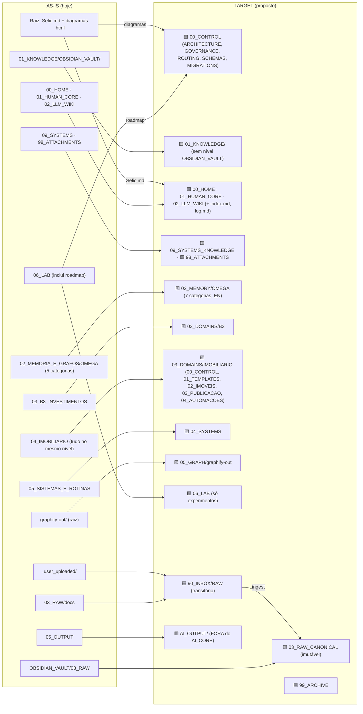

# Diagrama de Migração AI_CORE: AS-IS → TARGET

Legenda: 🟩 mantém · 🟨 move/renomeia · 🟥 sai do núcleo ou é absorvido · 🟦 novo

## Resumo do que muda

| Hoje | Vira | Tipo |
|---|---|---|
| Dois RAW + `.user_uploaded` | `90_INBOX/RAW` → `03_RAW_CANONICAL` | 🟥 consolidação |
| `05_OUTPUT/` | `AI_OUTPUT/` fora do núcleo | 🟥 sai |
| `02_MEMORIA_E_GRAFOS/OMEGA` | `02_MEMORY/OMEGA` (+ preferences, sessions) | 🟨 |
| `03_B3_INVESTIMENTOS`, `04_IMOBILIARIO` | `03_DOMAINS/B3`, `03_DOMAINS/IMOBILIARIO` | 🟨 |
| `05_SISTEMAS_E_ROTINAS` | `04_SYSTEMS` | 🟨 |
| `graphify-out/` | `05_GRAPH/graphify-out` | 🟨 |
| — | `00_CONTROL`, `90_INBOX`, `99_ARCHIVE` | 🟦 |
| Selic.md e diagramas na raiz | wiki / `00_CONTROL` | 🟨 |
