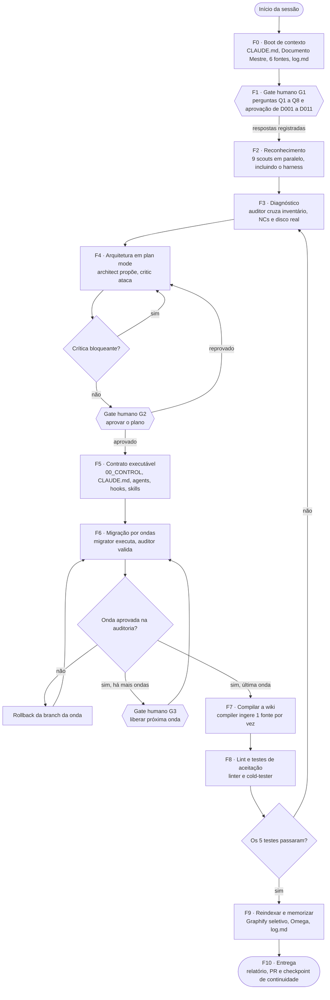
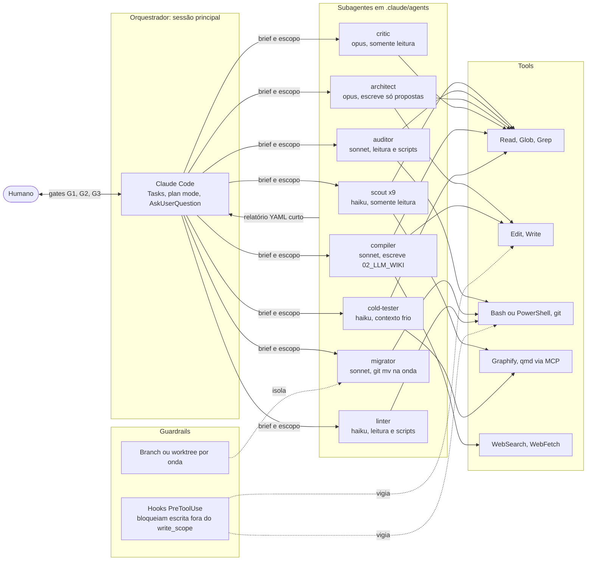
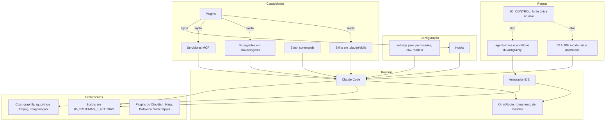
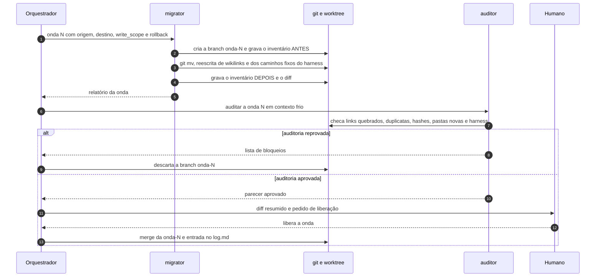
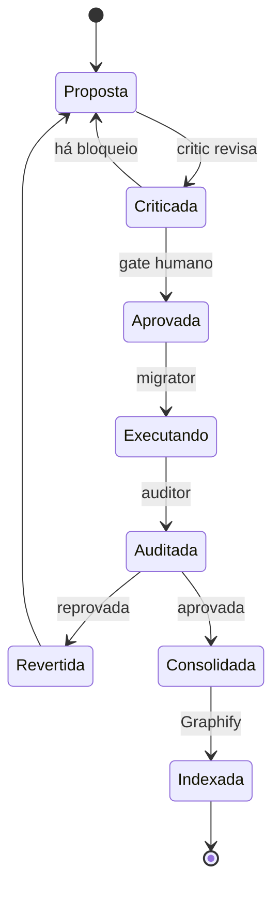

# Orquestração LLM: fluxo de arquitetura e trabalho do AI_CORE

Este arquivo é o **plano de voo** do agente (Claude Code) para sair do AI_CORE atual e chegar à arquitetura-alvo do [[AI_CORE_LLM_WIKI_MESTRE|Documento Mestre]]. Ele define:

- o que o agente lê primeiro;
- quando para e pergunta;
- quais subagentes chama, com quais tools e com que permissão de escrita;
- como cada mudança é auditada, revertida ou consolidada.

> [!important] Três princípios que valem em todas as fases
> 1. **O orquestrador pensa, os subagentes leem.** A sessão principal nunca varre o repositório inteiro. Ela delega a leitura e recebe relatórios curtos, o que preserva o contexto para decidir.
> 2. **Nada estrutural acontece sem gate.** Toda mudança de topologia segue o ciclo proposta → crítica → aprovação humana → execução → auditoria.
> 3. **Tudo é reversível.** Cada onda de migração roda em uma branch própria, com inventário antes e depois, e tem rollback pronto.

---

## 1. Visão macro: fases e gates



---

## 2. Topologia de agentes, tools e guardrails



---

## 3. Fases em detalhe

| Fase | Objetivo | Quem executa | Tools | Artefato de saída | Critério de saída |
|---|---|---|---|---|---|
| **F0 · Boot** | Carregar tudo o que foi decidido e planejado | Orquestrador | Read | Brief de contexto com, no máximo, 1 página nas Tasks | Brief cobre tese, TARGET, NCs, decisões e perguntas abertas |
| **F1 · Esclarecer** | Resolver as perguntas Q1–Q8 e aprovar ou rejeitar D001–D011 | Orquestrador e **humano** | AskUserQuestion | `00_CONTROL/DECISIONS.md` com o status de cada decisão | Nenhuma decisão ou pergunta bloqueante sem resposta |
| **F2 · Reconhecimento** | Inventariar o disco real, camada por camada | **9 scouts em paralelo** | Glob, Grep, Read (trechos), hash, Graphify | `00_CONTROL/MIGRATIONS/inventario.csv` e `00_CONTROL/HARNESS.md`, gravados pelo orquestrador | 100% das pastas de 1º nível e 100% dos componentes do harness cobertos |
| **F3 · Diagnóstico** | Confirmar ou refutar NC-01..NC-15, achar novas NCs e medir a deriva entre diagrama e disco | auditor | Read, scripts de auditoria | `00_CONTROL/MIGRATIONS/diagnostico.md` com baseline dos indicadores | Cada NC marcada como confirmada, refutada ou nova, com evidência |
| **F4 · Arquitetura** | Desenhar ARCHITECTURE, GOVERNANCE, ROUTING, SCHEMAS, o **harness-alvo** (§3.3) e o plano de ondas | architect, depois critic, **em loop** | Read, Write (só `00_CONTROL/proposals/`) | Proposta, parecer do critic e plano de ondas | Zero críticas bloqueantes e **aprovação humana (G2)** |
| **F5 · Contrato** | Tornar as regras executáveis **sem mover nada** (Fase 0 da auditoria) | Orquestrador | Write, Edit | `00_CONTROL/*`, adaptadores de CLAUDE.md e `.agents/rules`, `.claude/agents/*.md`, hooks, skills | Hooks testados: uma escrita fora do escopo é bloqueada |
| **F6 · Migração** | Aplicar o plano onda por onda | migrator e auditor | git, Bash, Edit | Uma branch por onda, inventário antes e depois, diff | Auditoria verde e **gate humano (G3)** em cada onda estrutural |
| **F7 · Compilar** | Popular `02_LLM_WIKI` (index, log, fontes, conceitos, entidades) | compiler | Read, Write, WebSearch (lacunas) | Páginas novas e atualizadas, `index.md`, `log.md` | Backlog do Apêndice C do Documento Mestre coberto |
| **F8 · Validar** | Lint completo e os 5 testes de aceitação | linter e cold-tester | Scripts, Read, Graphify | `00_CONTROL/MIGRATIONS/aceitacao.md` com os indicadores antes e depois | Os 5 testes passam e as metas de indicadores são atingidas |
| **F9 · Memorizar** | Reindexar e registrar | Orquestrador | Graphify, Write | `05_GRAPH/` atualizado, decisões aprovadas no Omega, entrada no `log.md` | Graphify não indexa a própria saída |
| **F10 · Entregar** | Fechar o ciclo | Orquestrador | git | PR, relatório final e checkpoint em `OMEGA/continuity/` | Uma nova sessão consegue retomar só com o checkpoint |

### 3.1 F2: divisão dos 9 scouts

Cada scout recebe **uma** fatia. Nenhum lê fora dela.

| Scout | Fatia (`AS-IS`) | Pergunta que responde |
|---|---|---|
| `scout-knowledge` | `01_KNOWLEDGE/OBSIDIAN_VAULT/` (menos 03_RAW) | Quais notas existem, com que frontmatter, e quais estão órfãs? |
| `scout-raw` | `OBSIDIAN_VAULT/03_RAW/`, `03_RAW/docs/`, `.user_uploaded/` | Quais arquivos estão duplicados (por hash) entre as portas de RAW? |
| `scout-omega` | `02_MEMORIA_E_GRAFOS/OMEGA/` | Quantas memórias há por categoria e quais não têm `type/domain/status`? |
| `scout-b3` | `03_B3_INVESTIMENTOS/` | Quais pastas são estado, quais são código e quais são saída? |
| `scout-imob` | `04_IMOBILIARIO/` | Quais pastas são infraestrutura, portal, template ou imóvel? Cada imóvel segue o contrato? |
| `scout-systems` | `05_SISTEMAS_E_ROTINAS/`, `06_LAB/` | Quais scripts existem, são idempotentes e dependem de caminhos fixos? |
| `scout-output` | `05_OUTPUT/` | Quais artefatos existem, quanto pesam e a que entidades se referem? |
| `scout-graph` | `graphify-out/`, `.obsidian/` (menos plugins), arquivos da raiz | O que o Graphify indexa hoje e o que está solto na raiz? |
| `scout-harness` | CLAUDE.md, `.claude/`, `.mcp.json`, plugins, `.agents/`, OmniRoute, plugins do Obsidian, CLIs | Quais regras, permissões, hooks, agentes, skills, plugins e ferramentas existem, o que cada um custa em contexto e onde conflitam? (§3.3) |

### 3.2 Contrato de retorno de todo subagente

O subagente **não devolve conteúdo bruto**. Ele devolve este formato, com no máximo cerca de 60 linhas:

```yaml
agent: scout-raw
scope: ["01_KNOWLEDGE/OBSIDIAN_VAULT/03_RAW", "03_RAW/docs", ".user_uploaded"]
summary: "3 portas de RAW, 212 arquivos, 37 duplicados por hash"
inventory_rows: 212          # linhas gravadas em arquivo temporário, não no retorno
inventory_file: "90_INBOX/_tmp/inventario_scout-raw.csv"
findings:
  - id: NC-01
    status: confirmed          # confirmed | refuted | new
    evidence: ["03_RAW/docs/x.pdf == OBSIDIAN_VAULT/03_RAW/x.pdf (sha256 igual)"]
  - id: NEW-01
    status: new
    evidence: ["..."]
questions_for_human: []      # só o que o agente NÃO pode decidir
confidence: high             # high | medium | low
```

### 3.3 Análise do harness: CLAUDE.md, config, hooks, agentes, skills, plugins e ferramentas

O harness é **o que controla os agentes**. Se ele estiver fragmentado, com regras duplicadas, permissões amplas demais, skills sobrepostas ou caminhos antigos fixos no código, qualquer arquitetura nova vai derivar de novo. Por isso o harness é auditado **antes** de desenhar a arquitetura, e reescrito junto com ela.



**Matriz de análise.** O `scout-harness` preenche uma linha por componente.

| Componente | Onde procurar | O que verificar |
|---|---|---|
| **CLAUDE.md** | Raiz, `CLAUDE.md` aninhados em subpastas, `CLAUDE.local.md`, `~/.claude/CLAUDE.md` (usuário, se acessível), `@imports` | Tamanho (é carregado em **toda** sessão), regras duplicadas com `.agents/rules`, instruções contraditórias, caminhos que vão mudar na migração (`05_OUTPUT`, `03_RAW`…) |
| **Configuração** | `.claude/settings.json`, `.claude/settings.local.json`, `~/.claude/settings.json` | Permissões amplas demais (ex.: `Bash(*)` sem `deny`), `env`, modelo padrão, plugins habilitados |
| **Hooks** | Chave `hooks` nos settings, scripts chamados | O que existe, o que bloqueia, se é idempotente, se já cobre alguma das Regras 1–10 |
| **Subagentes** | `.claude/agents/*.md` e agentes vindos de plugins | Tools e modelo de cada um, sobreposição de papéis, agentes que escrevem sem escopo |
| **Skills** | `.claude/skills/*/SKILL.md` e skills vindas de plugins | Descrições que disparam em situações erradas, skills redundantes, referências a arquivos ou caminhos mortos. Inclui a skill do Graphify |
| **Slash commands** | `.claude/commands/` | Comandos duplicados de skills, comandos obsoletos |
| **Plugins** | Plugins instalados e marketplaces (`/plugin`), `enabledPlugins` | O que cada plugin injeta (skills, agentes, hooks, MCP), se ainda é usado |
| **Servidores MCP** | `.mcp.json`, config do usuário | Quais tools cada servidor expõe, custo das definições de tools no contexto, servidores sem uso (Graphify, qmd, web search, Obsidian) |
| **Antigravity** | `.agents/rules/`, `.agents/workflows/` (ex.: `graphify.md`) | Regras que divergem do CLAUDE.md, a configuração do perfil executor/arquiteto que "sai executando" |
| **OmniRoute** | Config do gateway em localhost | Quais modelos e provedores estão disponíveis (decisão "provedor NVIDIA"), se os modelos do catálogo §6 existem ali, fallback |
| **Plugins do Obsidian** | `.obsidian/community-plugins.json`, `core-plugins.json`, `.obsidian/plugins/` | Presença de Marp, Dataview, Web Clipper e Git, e plugins que reescrevem arquivos (ex.: formatadores) e brigam com o agente |
| **Ferramentas e scripts** | `PATH` (graphify, rg, python, ffmpeg, imagemagick), `05_SISTEMAS_E_ROTINAS/` | Versões, quais scripts os agentes chamam de fato, caminhos fixos, idempotência |

**Classificação de cada componente:** `manter` · `adaptar` (ex.: trocar caminhos, reduzir permissões) · `fundir` (ex.: duas skills em uma) · `arquivar` (vai para `99_ARCHIVE/`, nunca é apagado).

> [!danger] Segredos
> Settings, config de MCP e do OmniRoute costumam conter chaves de API. O `scout-harness` **nunca copia valores de segredos** para relatórios, inventário ou commits. Ele registra só o nome da variável e a informação "presente" ou "ausente".

**Saída:** `00_CONTROL/HARNESS.md`, com três partes:

1. o inventário do harness;
2. a matriz de conflitos (regra A × regra B, skill A × skill B, permissão × Regra);
3. a **lista de caminhos fixos**, isto é, todo arquivo do harness que cita uma pasta que vai mudar. O migrator usa essa lista em cada onda para atualizar o harness junto com as pastas.

**Harness-alvo** (desenhado em F4, montado em F5):

```text
AI_CORE/
├── CLAUDE.md                  # adaptador curto: aponta para 00_CONTROL, sem regras próprias
├── .claude/
│   ├── settings.json          # permissões mínimas + hooks dos guardrails (§7)
│   ├── agents/                # catálogo do §6
│   ├── skills/                # ingest · query · lint · migrate-wave · graphify
│   └── commands/              # só atalhos que não duplicam skills
├── .mcp.json                  # só os servidores usados (Graphify, qmd, web search)
├── .agents/rules|workflows/   # adaptador do Antigravity: aponta para 00_CONTROL
└── 00_CONTROL/
    ├── GOVERNANCE.md          # fonte única de regras (D010)
    ├── ROUTING.md             # que agente/modelo faz o quê, via OmniRoute
    ├── HARNESS.md             # inventário e decisões do harness
    └── hooks/                 # scripts dos guardrails
```

---

## 4. Uma onda de migração, passo a passo



### 4.1 Ordem das ondas

A ordem segue as prioridades P0–P3 e as Fases 0–7 do Documento Mestre:

| Onda | Conteúdo | NCs resolvidas | Gate humano |
|---|---|---|:-:|
| **W0** | Criar `00_CONTROL/` e as regras. **Nada é movido.** | Base para todas | sim |
| **W1** | Unificar as portas de RAW em `90_INBOX/RAW` e `01_KNOWLEDGE/03_RAW_CANONICAL` | NC-01, NC-09 | sim |
| **W2** | Numeração única na raiz: `03_DOMAINS`, `04_SYSTEMS`, `05_GRAPH`, `02_MEMORY` | NC-02 | sim |
| **W3** | Limpar a raiz: Selic para a wiki, diagramas para `00_CONTROL` | NC-07, NC-10, NC-11 | sim |
| **W4** | Tirar `05_OUTPUT` do núcleo para `AI_OUTPUT/`, deixando manifestos no lugar | NC-06, NC-12 | sim |
| **W5** | Omega: piloto com 10 registros de 4 categorias, depois o restante | NC-03 | sim |
| **W6** | Imobiliário: padrão ouro, depois 1 imóvel, depois o lote | NC-05, NC-13 | sim |
| **W7** | Regras de inclusão e exclusão do Graphify e reindexação | NC-04 | não |
| **W8** | Roadmap para `00_CONTROL/MIGRATIONS`, `06_LAB` só com experimentos | NC-15 | não |

> [!warning] Wikilinks em migração
> O Obsidian só atualiza links automaticamente quando o arquivo é movido **dentro do app**. Um `git mv` feito pelo agente não atualiza nada. Por isso toda onda inclui a reescrita de links e a checagem de links quebrados pelo auditor. Pelo mesmo motivo, a onda também atualiza os caminhos fixos do harness listados em `00_CONTROL/HARNESS.md` (CLAUDE.md, rules, skills, scripts); sem isso, os agentes continuam apontando para as pastas antigas. Links no formato caminho-sufixo (§0.2 do Documento Mestre) sobrevivem à maioria dos movimentos.

---

## 5. Ciclo de vida de uma mudança estrutural



---

## 6. Catálogo de subagentes

Cada subagente vira um arquivo em `.claude/agents/<nome>.md`. Os modelos são uma sugestão: barato para ler, forte para desenhar e criticar.

| Subagente | Modelo | Tools | `write_scope` | Chamado em |
|---|---|---|---|---|
| `scout-*` | haiku | Read, Glob, Grep, Bash (só hash e listagem) | `90_INBOX/_tmp/` | F2 |
| `auditor` | sonnet | Read, Glob, Grep, Bash (scripts de auditoria) | `00_CONTROL/MIGRATIONS/` | F3, F6 |
| `architect` | opus | Read, Glob, Grep, Write | `00_CONTROL/proposals/` | F4 |
| `critic` | opus | Read, Glob, Grep | nenhum | F4 |
| `migrator` | sonnet | Read, Edit, Bash (git) | Só os caminhos de origem e destino da onda | F6 |
| `compiler` | sonnet | Read, Write, Edit, WebSearch, WebFetch | `02_LLM_WIKI/` | F7 |
| `linter` | haiku | Read, Glob, Grep, Bash (scripts) | `00_CONTROL/MIGRATIONS/` | F8 |
| `cold-tester` | haiku | Read, Glob, Grep, Graphify | nenhum | F8 |

Exemplo de definição:

```markdown
---
name: scout-raw
description: Read-only inventory of every RAW entry point. Use in phase F2 only.
tools: Read, Glob, Grep, Bash
model: haiku
---
You inventory ONLY these paths: 01_KNOWLEDGE/OBSIDIAN_VAULT/03_RAW, 03_RAW/docs, .user_uploaded.
Never edit, move or delete anything. Compute sha256 for each file to detect duplicates.
Write inventory rows to 90_INBOX/_tmp/inventario_scout-raw.csv.
Return ONLY the YAML report defined in ORQUESTRACAO_LLM_AI_CORE.md §3.2.
```

### 6.1 Por que o `critic` e o `cold-tester` existem

- **`critic`** é um revisor independente. O architect tende a gostar do próprio plano, e o critic recebe **só a proposta e o Documento Mestre**, com a missão de encontrar o que quebra: fontes canônicas duplicadas, ondas sem rollback, regras que conflitam, caminhos esquecidos.
- **`cold-tester`** roda os testes de aceitação **sem nenhum contexto da sessão**. Se ele encontra as regras do imóvel X, a decisão original e o ponto de retomada **abrindo poucos arquivos**, a arquitetura funciona para qualquer agente futuro, e não só para quem acabou de construí-la.

---

## 7. Guardrails executáveis

As Regras 1–10 do Documento Mestre deixam de ser só texto e viram mecanismos:

| Regra | Mecanismo |
|---|---|
| 1. Sem nova pasta de 1º nível | Hook `PreToolUse` em Write, Edit e Bash bloqueia criação na raiz fora da onda W2 |
| 2 e 3. Sem mover canônico em tarefa de conteúdo | O `write_scope` da missão não inclui origens de migração; o hook bloqueia |
| 4. Declarar SOURCE_OF_TRUTH, WRITE_SCOPE, OUTPUT_PATH, MEMORY_POLICY | Arquivo `.mission.yaml` obrigatório; sem ele o hook bloqueia qualquer escrita |
| 5. Graphify localiza, não autoriza | Só o scout e o cold-tester têm Graphify; quem escreve não tem |
| 6. Saídas em AI_OUTPUT | O hook bloqueia escrita de binários (`.pdf`, `.pptx`, `.png` grandes) dentro do AI_CORE |
| 7. Inventário antes e depois | Etapa obrigatória do migrator (§4) |
| 8. Duas fontes canônicas: parar | O subagente devolve `questions_for_human` e o orquestrador aciona um gate |
| 9. Hipótese não vira decisão no Omega | Só o orquestrador grava no Omega, e só depois de aprovação em F1/G2 |
| 10. Automação idempotente | O auditor roda cada script duas vezes e compara os resultados |

Esboço do hook em `.claude/settings.json`:

```json
{
  "hooks": {
    "PreToolUse": [
      {
        "matcher": "Write|Edit|Bash",
        "hooks": [
          { "type": "command", "command": "python 00_CONTROL/hooks/guard_write_scope.py" }
        ]
      }
    ]
  }
}
```

O script lê o `tool_input` pelo stdin, compara o caminho com o `write_scope` do `.mission.yaml` ativo e **sai com código 2** para bloquear. Nesse caso, o motivo do bloqueio volta para o agente.

---

## 8. Regras do orquestrador

1. **Contexto é orçamento.** O orquestrador lê só o Documento Mestre, este arquivo, os relatórios YAML e os diffs resumidos. Leitura de pasta é sempre delegada.
2. **Descoberta barata antes de leitura cara.** Primeiro `index.md` e Graphify, depois 3 a 10 arquivos. Nunca varredura ampla.
3. **Paralelize o que é independente.** Os 9 scouts rodam juntos em F2. Arquitetura e migração são **sequenciais**.
4. **Tasks sempre atualizadas.** Cada fase e cada onda é uma task. Só há uma task em andamento por vez.
5. **Checkpoint no fim de cada fase.** Uma nota em `OMEGA/continuity/` com o que foi feito, o que falta e onde retomar. Uma sessão nova recomeça dali (Teste 3).
6. **Pare e pergunte quando:**
   - houver duas fontes canônicas;
   - uma memória não tiver categoria inequívoca;
   - aparecer uma NC fora do registro;
   - qualquer ação envolver **apagar** algo;
   - um subagente devolver `confidence: low`.
7. **Nunca:**
   - apagar em vez de arquivar (use `99_ARCHIVE/`);
   - usar force-push;
   - mover arquivos em uma onda não aprovada;
   - gravar decisões `proposed` no Omega.

---

## 9. Perguntas do gate G1

O fluxo não avança de F1 enquanto estas perguntas não tiverem resposta:

| ID | Pergunta | Afeta |
|---|---|---|
| Q-A | O alvo é uma pasta nova (`/raw` + `/wiki` puros), o AI_CORE existente, ou os dois? | Todo o fluxo |
| Q-B | O agente pode migrar arquivos existentes, ou só criar a estrutura e o contrato (até F5)? | F6 |
| Q-C | Quais decisões de D001 a D011 viram regra? | F4, F5 |
| Q-D | Ingestão uma fonte por vez com revisão, ou em lote? | F7 |
| Q-E | Nomes de pastas e notas em português ou em inglês? | F4, F6 |
| Q-F | O contrato vale só para o Claude Code ou também para o Antigravity (`.agents/rules`)? | F5 |
| Q-G | Incluir Marp, Dataview, qmd e as regras do Graphify já no setup? | F5, F9 |
| Q-H | O que é a "trindade dos plugins"? | Documentação |
| Q1–Q7 | Perguntas abertas do §8.4 do Documento Mestre | F4, F6 |

---

## 10. Kickoff para o agente

Bloco para colar no Claude Code, aberto na raiz do AI_CORE. Ele será substituído pelo prompt completo em inglês depois que as perguntas do G1 forem respondidas.

```text
You are the orchestrator for the AI_CORE architecture program.
1. Read AI_CORE_LLM_WIKI_MESTRE.md and ORQUESTRACAO_LLM_AI_CORE.md in full. Do not read anything else yet.
2. Create one task per phase (F0–F10). Work strictly in order; only one task in progress at a time.
3. Phase F1: ask me every open question in §9 using AskUserQuestion. Do not continue until each one is answered.
4. Never read directories yourself: delegate to the subagents in §6 and accept only the YAML report in §3.2.
   In F2, the harness audit (§3.3) is mandatory: CLAUDE.md files, settings and permissions, hooks, subagents,
   skills, slash commands, plugins, MCP servers, Antigravity rules, OmniRoute, Obsidian plugins and CLI tools.
   Never copy secret values into any report or commit.
5. Enter plan mode for F4. Nothing structural is moved before I approve the plan (gate G2).
6. Execute migration only in the waves of §4.1, one branch per wave, with inventory before and after and a ready rollback.
7. Write a continuity checkpoint at the end of every phase.
```
